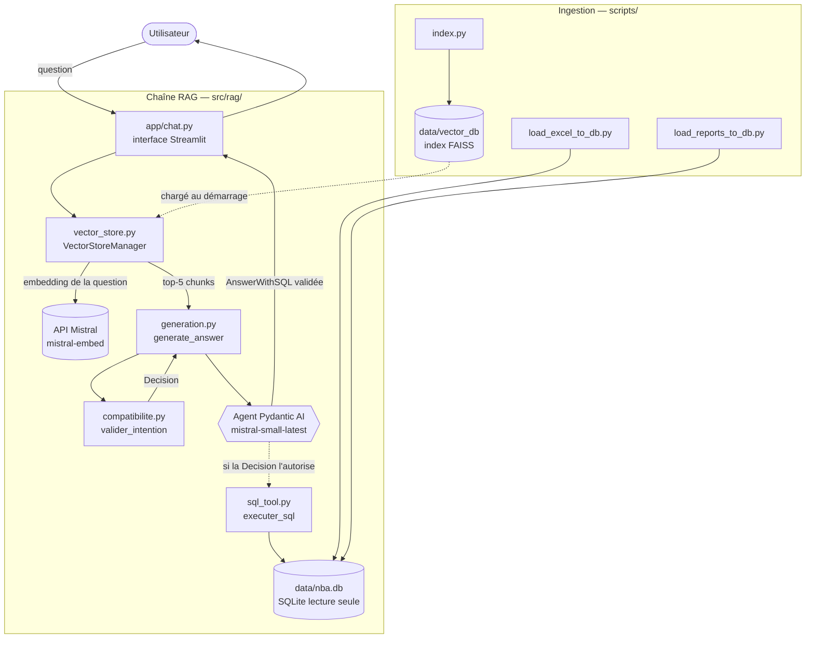
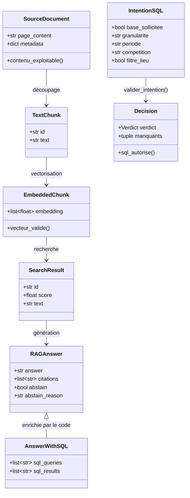
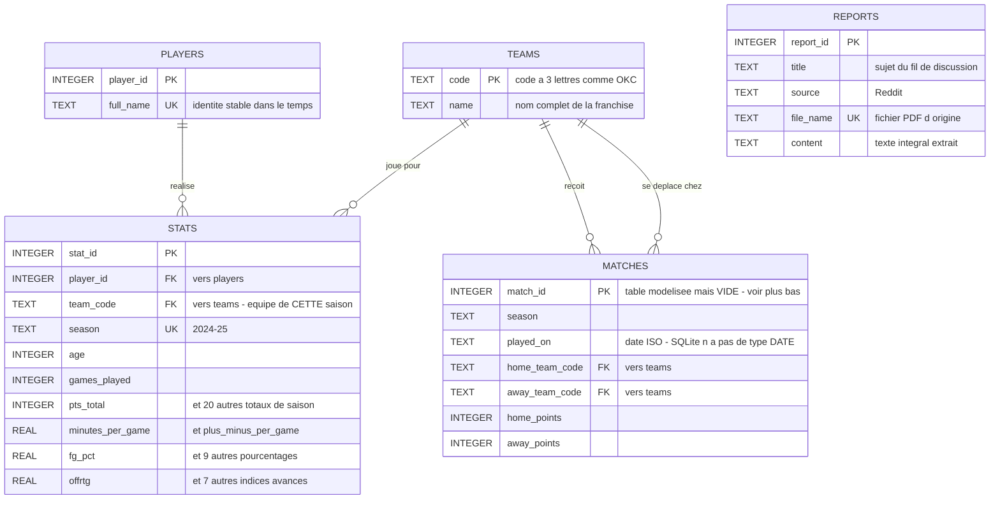

# Projet 10 — Assistant IA d'analyse de performance NBA (SportSee)

## Contexte

SportSee est une startup spécialisée dans l'IA appliquée à l'analyse de performance sportive. Ce projet fait évoluer un prototype d'assistant conversationnel (RAG + Mistral) pour qu'il puisse répondre de façon fiable à des questions analytiques précises sur des statistiques NBA (ex. *"Quel joueur a le meilleur pourcentage de réussite à 3 points sur les 5 derniers matchs ?"*), et pas seulement à des questions générales sur du contenu textuel.

## Architecture

Le système répond à une question en croisant **deux sources** : un index vectoriel pour le
qualitatif (discussions Reddit) et une base relationnelle pour le chiffré (statistiques NBA).
Deux garde-fous déterministes encadrent la branche chiffrée.

### Vue d'ensemble



### Le parcours d'une question


### Schéma de la base relationnelle

Cinq tables, dont `matches` **modélisée mais vide** (aucune source ne permet de l'alimenter) et
`reports` **masquée au tool SQL**. Le diagramme entité-association détaillé, avec les types
SQLite réels et les clés, se trouve dans la section
[Base de données relationnelle](#base-de-données-relationnelle-datanbadb).

### Contrats de données

Chaque étape du pipeline produit un objet validé par Pydantic. Une donnée invalide s'arrête à
la frontière où elle apparaît, au lieu de se propager.



`AnswerWithSQL` **hérite** de `RAGAnswer` au lieu d'ajouter un champ : le modèle ne reçoit que
le schéma de `RAGAnswer`, il ne peut donc pas déclarer lui-même les requêtes qu'il a exécutées.
C'est le code qui les renseigne depuis la trace.

## Installation (environnement reproductible avec uv)

Le projet est géré avec [uv](https://docs.astral.sh/uv/) — `pyproject.toml` et `uv.lock` remplacent volontairement un `requirements.txt` classique : ils figent aussi les dépendances transitives (ce qu'un simple `requirements.txt` ne garantit pas), tout en restant équivalents pour l'installation.

```bash
# 1. Installer les dépendances dans un environnement virtuel dédié (.venv)
uv sync

# 2. Configurer la clé API Mistral
# Créer un fichier .env à la racine avec :
# MISTRAL_API_KEY="votre_clé"
# (clé à obtenir sur https://console.mistral.ai/)
```

Python 3.11 est pinné (`.python-version`) — version choisie pour la compatibilité de l'écosystème ML (`faiss-cpu`, `torch`/`easyocr` n'ont pas encore de wheels pour les versions Python les plus récentes).

## Lancer le projet

Trois étapes d'ingestion, puis l'application. Les deux premières ne sont à refaire que si
`data/inputs/` change — leurs sorties sont régénérables et non versionnées.

```bash
# 1. Index vectoriel (FAISS) à partir des documents de data/inputs/
uv run python scripts/index.py

# 2. Base relationnelle : statistiques depuis le classeur Excel...
uv run python scripts/load_excel_to_db.py
#    ...puis les 4 PDF Reddit dans la table reports
uv run python scripts/load_reports_to_db.py

# 3. Lancer l'interface
uv run streamlit run app/chat.py
```

Un premier lancement complet prend quelques minutes, l'indexation étant la plus longue
(appels d'embedding à l'API Mistral, un par chunk).

## Structure du dépôt

```
.
├── app/
│   └── chat.py                     # interface Streamlit (point d'entrée utilisateur)
├── src/                            # code réutilisable, importé par app/, scripts/ et eval/
│   ├── config.py                   # clés, modèles, chemins, SEARCH_K
│   ├── schemas.py                  # 11 contrats Pydantic du pipeline
│   ├── db_models.py                # tables SQLAlchemy (players, stats, teams, matches, reports)
│   ├── loading/
│   │   └── loaders.py              # extraction multi-format (PDF/OCR, DOCX, TXT, CSV, Excel)
│   └── rag/
│       ├── vector_store.py         # FAISS + embeddings Mistral (VectorStoreManager)
│       ├── generation.py           # agent Pydantic AI, prompts, assemblage, verify_citations
│       ├── compatibilite.py        # validateur question ↔ schéma (registre de capacités)
│       └── sql_tool.py             # exécution SQL sous 4 barrières SQLite
├── scripts/
│   ├── index.py                    # construit l'index vectoriel
│   ├── load_excel_to_db.py         # peuple players / stats / teams depuis le classeur
│   └── load_reports_to_db.py       # peuple reports depuis les PDF Reddit
├── eval/
│   ├── testset.json                # 24 cas : 8 simples / 8 complexes / 8 bruités
│   ├── evaluate_ragas.py           # exécute le système et le fait juger par RAGAS
│   ├── analyze_results.ipynb       # analyse et comparaison des runs
│   └── results/                    # un JSON par run (baseline, pydantic, tool_sql, guardrails)
├── tests/                          # 129 tests gratuits + 41 marqués api / slow
├── data/
│   ├── inputs/                     # documents sources (4 PDF Reddit + regular NBA.xlsx)
│   ├── vector_db/                  # index FAISS + chunks (régénérable)
│   └── nba.db                      # base SQLite (régénérable)
├── pyproject.toml                  # dépendances et configuration pytest (uv)
├── uv.lock                         # versions verrouillées, transitives comprises
└── P10_DSML/                       # prototype de référence, local uniquement, non versionné
```

`data/vector_db/` et `data/nba.db` sont **gitignorés** : tous deux se reconstruisent depuis
`data/inputs/` par les trois scripts d'ingestion. Seules les sources sont versionnées.

`P10_DSML/` est volontairement absent du dépôt git : c'est le prototype d'origine, conservé
intact en local comme référence, jamais modifié directement.

## Analyse du prototype de référence (P10_DSML)

Le prototype fourni est un pipeline RAG texte classique :

| Fichier | Rôle |
|---|---|
| `utils/config.py` | Configuration centralisée (clé API, modèles Mistral, taille de chunks, chemins) |
| `utils/data_loader.py` | Extraction de texte multi-formats (PDF avec fallback OCR, DOCX, TXT, CSV, Excel) |
| `utils/vector_store.py` (`VectorStoreManager`) | Découpage en chunks, génération d'embeddings (`mistral-embed`), index FAISS (`IndexFlatIP`, similarité cosinus), recherche top-k |
| `indexer.py` | Script CLI orchestrant l'indexation complète (chargement → chunking → embeddings → sauvegarde) |
| `MistralChat.py` | Interface Streamlit : question → recherche vectorielle → contexte injecté dans un prompt → génération (`mistral-small-latest`) |

**Données sources** : 4 PDF de discussions Reddit (contenu narratif) + 1 fichier Excel `regular NBA.xlsx` (statistiques de matchs, données structurées).

### Limite diagnostiquée

Le fichier Excel de statistiques est traité comme du texte brut chunké (`df.to_string()` puis découpage par caractères), au même titre que les PDF Reddit. Testé en conditions réelles sur les questions cibles de la mission :

- La récupération sémantique fonctionne bien sur le contenu narratif (PDF Reddit) : réponses correctement sourcées.
- Sur les questions analytiques nécessitant un calcul (ex. % de réussite à 3 points sur les 5 derniers matchs), le modèle ne retrouve pas de données exploitables dans les chunks Excel, et complète sa réponse avec des chiffres qui ne proviennent pas des données réelles de SportSee (connaissances générales du modèle, non vérifiables, potentiellement fausses) — sans le signaler clairement à l'utilisateur.

Cette limite oriente la conception de l'architecture cible : la recherche sémantique par similarité de texte n'est pas adaptée pour répondre à des questions nécessitant filtrage/agrégation sur des données structurées.

### Correctifs d'environnement appliqués lors de la reprise du code

Deux problèmes indépendants de la logique métier ont dû être corrigés pour que le code fonctionne (nécessaires sur cette machine, pas des choix de conception) :

- **TLS** (`src/rag/vector_store.py`) : les appels à l'API Mistral échouaient (`CERTIFICATE_VERIFY_FAILED`) derrière le proxy/antivirus local qui inspecte le trafic HTTPS. Corrigé via [`truststore`](https://github.com/sethmlarson/truststore), qui fait confiance au magasin de certificats du système plutôt qu'au bundle `certifi` embarqué.
- **Encodage console Windows** (`src/loading/loaders.py`) : les barres de progression d'EasyOCR (caractères Unicode `█`) faisaient planter l'initialisation de l'OCR sur la console Windows par défaut (non-UTF-8), empêchant toute extraction des PDF scannés. Corrigé en forçant `stdout`/`stderr` en UTF-8 au démarrage.

## Base de données relationnelle (`data/nba.db`)

Construite depuis `regular NBA.xlsx` par `uv run python scripts/load_excel_to_db.py`. Elle est **entièrement régénérable**, donc gitignorée comme l'index vectoriel. SQLite a été retenu pour le faible volume (599 lignes), l'usage mono-utilisateur en lecture, et l'absence de serveur à déployer ; SQLAlchemy garde l'architecture portable vers PostgreSQL par simple changement d'URL.



`REPORTS` n'a aucune clé étrangère : rien dans ces discussions ne se rattache de façon fiable à un joueur ou à une équipe identifiés. Les rattacher demanderait une extraction d'entités, qui introduirait ses propres erreurs.

### Les clés

| Relation | Signification |
|---|---|
| `stats.player_id` → `players.player_id` | de qui sont ces statistiques |
| `stats.team_code` → `teams.code` | dans quelle équipe, **cette saison-là** |
| `UNIQUE (player_id, season)` | définit le grain : une ligne = un joueur sur une saison |

`stats` est la seule table qui pointe vers les autres : elle porte les faits, `teams` et `players` sont des tables de référence. L'équipe et l'âge sont sur `stats` et non sur `players`, parce qu'ils changent d'une saison à l'autre.

### Conventions de nommage

Le fichier source mélange les unités sans le documenter — son dictionnaire annonce « en moyenne par match » pour des colonnes qui sont en réalité des totaux. Les suffixes lèvent l'ambiguïté :

| Suffixe | Sens | Exemple (SGA) |
|---|---|---|
| `_total` | agrégat de la saison | `pts_total` = 2485 |
| `_per_game` | moyenne par match | `minutes_per_game` = 34,2 |
| `_pct` | pourcentage 0-100 | `fg_pct` = 51,9 |
| *aucun* | indice déjà normalisé | `offrtg` = 122 |

C'est une précaution nécessaire : ces noms seront injectés dans le prompt du tool SQL, et une colonne `pts` ambiguë produirait des réponses du type *« SGA marque 2485 points par match »*.

### Anomalies des données source, corrigées ou documentées

- **Colonne `3PM`** : Excel a interprété l'en-tête comme l'horaire « 3 PM » et l'a stocké en `datetime.time(15, 0)`. Seul le nom était perdu — les valeurs sont intactes. Renommée à l'ingestion en `three_pm_total`, avec un contrôle permanent (`three_pm ≤ three_pa`) qui arrêterait l'ingestion si un futur export décalait les colonnes.
- **Pourcentages** : `fg_pct` ne coïncide pas exactement avec `fgm_total / fga_total`, et la cause n'est **pas** établie. Mesuré sur les 566 joueurs : l'écart moyen tombe de 0,97 point (sous 100 tirs tentés) à 0,22 point (au-delà de 600), et SGA affiche 51,9 stocké contre 51,8 calculé. Mais l'incohérence est réelle chez les faibles volumes — Liam Robbins figure dans le fichier avec `FGM=3, FGA=8, FG%=25.0`, alors que 3/8 = 37,5 %. Testé et écarté : décalage de lignes (écart de 0,51 à décalage nul contre ~9 pour tout autre décalage), simple arrondi, erreur systématique de ±1. **La source est incohérente avec elle-même** sur les joueurs à faible temps de jeu ; `ft_pct` est le cas le plus marqué (318 joueurs sur 566 s'écartent de plus d'un point). On lit donc la colonne `_pct` telle quelle — c'est le pourcentage officiel publié — sans jamais la recalculer.
- **Totaux dérivés** : ~95 % se reconstruisent par `round(moyenne par match, 1) × matchs joués`, d'où une imprécision d'environ 0,3 %.
- **`reb_total` ≠ `oreb_total` + `dreb_total`** dans ce fichier.

### Requêtes types

Les trois tableaux d'analyse du classeur (*Analyse de la saison*, *Analyse d'une équipe*, *Top 15 des joueurs en points*) sont des **agrégats dérivés** de la feuille `Données NBA` — ils ne deviennent donc pas des tables, mais des requêtes :

```sql
-- Top 15 des marqueurs
SELECT p.full_name, s.pts_total
FROM stats s JOIN players p USING (player_id)
ORDER BY s.pts_total DESC LIMIT 15;

-- Analyse d'une équipe
SELECT p.full_name, s.pts_total, s.reb_total, s.ast_total
FROM stats s JOIN players p USING (player_id)
JOIN teams t ON t.code = s.team_code
WHERE t.name = 'Detroit Pistons';

-- Total de points par équipe sur la saison
SELECT t.name, SUM(s.pts_total) AS points
FROM stats s JOIN teams t ON t.code = s.team_code
GROUP BY t.name ORDER BY points DESC;
```

Agrégations multicritères — c'est là que le tool SQL apporte ce que la recherche vectorielle ne sait pas faire, un seuil de volume ne pouvant pas s'exprimer par similarité de texte :

```sql
-- Meilleur pourcentage à trois points, à volume significatif
-- (Zach LaVine, 44,6 % sur 533 tentatives)
SELECT p.full_name, s.three_p_pct, s.three_pa_total
FROM stats s JOIN players p USING (player_id)
WHERE s.three_pa_total > 300
ORDER BY s.three_p_pct DESC LIMIT 1;

-- Équipes comptant au moins 8 joueurs à 40 matchs ou plus
-- WHERE filtre les lignes, HAVING filtre les groupes
SELECT t.name, COUNT(*) AS joueurs, SUM(s.pts_total) AS points
FROM stats s JOIN teams t ON t.code = s.team_code
WHERE s.games_played >= 40
GROUP BY t.name HAVING COUNT(*) >= 8
ORDER BY points DESC;
```

Les **comparaisons domicile/extérieur** que suggère la consigne ne sont pas calculables : voir `matches` ci-dessous.

### `matches` : modélisée, volontairement vide

La consigne demande de **modéliser** `matches`. Le schéma est donc posé avec ses clés (`home_team_code` et `away_team_code` vers `teams`), mais la table reste vide : aucune source ne permet de l'alimenter. Le classeur ne contient que des agrégats de saison — vérifié sur les 47 colonnes, il n'y a ni date, ni adversaire, ni identifiant de rencontre.

C'est précisément ce qui rend les questions domicile/extérieur sans réponse calculable, conformément aux cas B1 et B2 du jeu de test : l'agent s'abstient au lieu d'inventer. Alimenter cette table exigerait une seconde source (calendrier officiel ou box scores).

### `reports` : redondance assumée avec l'index vectoriel

Alimentée par `uv run python scripts/load_reports_to_db.py`, une ligne par PDF Reddit.

Ces fichiers sont des impressions navigateur, dont trois nécessitent un OCR. Le `title` est donc reconstitué par heuristique : la première ligne est la date d'impression, pas le sujet — c'est le bloc suivant, jusqu'aux éléments de navigation du site, qui porte le titre, parfois replié sur plusieurs lignes. Sur `Reddit 2.pdf`, l'OCR perd quelques mots de l'en-tête ; le titre reste reconnaissable mais approximatif.

Cette table contient **les mêmes textes que l'index FAISS**, qui les stocke découpés en chunks et vectorisés. La duplication est volontaire : SQLite donne la représentation relationnelle des sources demandée par la modélisation, FAISS reste le mécanisme de recherche sémantique.

### `reports` et `matches` sont masquées au tool SQL

L'agent **ne peut pas** interroger ces deux tables : elles sont absentes de la description qu'il reçoit, et l'autoriseur refuse toute lecture qui les touche (`TABLES_MASQUEES` dans [`sql_tool.py`](src/rag/sql_tool.py)).

Ce n'est pas une mesure de sécurité — ce sont nos propres données — mais de pertinence, pour deux raisons distinctes :

- **`reports`** : un `WHERE content LIKE '%...%'` sur des documents de 14 à 56 Ko serait un substitut médiocre à la recherche par similarité, et une poignée de lignes saturerait le prompt. Les questions d'opinion passent par le RAG vectoriel, qui sait les traiter.
- **`matches`** : elle est vide. Si l'agent la voyait, il écrirait une requête sur une question domicile/extérieur, obtiendrait zéro ligne et pourrait en tirer une conclusion erronée — alors que le comportement attendu est une abstention explicite.

C'est une liste **noire** et non blanche, contrairement aux opérations autorisées. Une CTE matérialisée est relue par SQLite via son alias (`WITH top AS (...) ... FROM top` déclenche une lecture de « top ») : une liste blanche de vraies tables la rejetterait à tort.

## Tool SQL

Les questions chiffrées ne passent plus par la recherche vectorielle seule : l'agent
dispose d'un tool qui interroge directement la base. Il reçoit le schéma et quelques
exemples de requêtes dans la description du tool, écrit le SQL, et le tool l'exécute.

### Exécution : pourquoi pas le tool SQL de LangChain

`SQLDatabase` de LangChain sert ici à **décrire** le schéma (`get_table_info()`), mais
l'exécution passe par [`src/rag/sql_tool.py`](src/rag/sql_tool.py) et non par
`QuerySQLDatabaseTool`. Ce dernier ouvre la base en lecture/écriture et exécute tel quel
le SQL produit par le modèle, sans autoriseur ni délai d'exécution.

C'est un modèle de langage qui écrit ces requêtes : la protection ne repose donc pas sur
une inspection du texte, contournable, mais sur quatre barrières dont trois appliquées
par SQLite lui-même.

| Barrière | Mécanisme | Ce qu'elle arrête |
|---|---|---|
| Lecture seule | `file:...?mode=ro` | toute écriture, quelle que soit la requête |
| Autoriseur | `set_authorizer` | PRAGMA, ATTACH, CTE récursives, `load_extension` |
| Délai | `set_progress_handler` | produits cartésiens et requêtes qui n'aboutissent pas |
| Limites de taille | `LIMIT` + `SQLITE_LIMIT_LENGTH` | résultats et valeurs qui satureraient le prompt |

Une requête rejetée n'interrompt pas le run : son message remonte au modèle via
`ModelRetry`, qui corrige sa requête et réessaie. Les messages distinguent donc les cas
(« invalide : no such column » ≠ « refusée »), car c'est sur eux que le modèle se corrige.

### Traçabilité

`AnswerWithSQL.sql_queries` contient les requêtes **réellement exécutées**, relevées par
le code dans la trace du run — jamais déclarées par le modèle. Une requête affichée dans
l'interface ou enregistrée dans les résultats d'évaluation a donc forcément tourné sur la
base. Même principe que `citations`, vérifiées en Python plutôt qu'auto-déclarées.

## Évaluation

Deux dispositifs distincts, à ne pas confondre : les **tests** vérifient que le code fait ce
qu'on attend, l'**évaluation RAGAS** mesure la qualité des réponses du système.

### Tests

```bash
# Suite gratuite : 129 tests, aucun appel réseau, quelques secondes
uv run pytest

# Tests appelant réellement Mistral (payants, explicitement exclus par défaut)
uv run pytest -m api

# Tests chargeant le modèle OCR (lents)
uv run pytest -m slow
```

Les trois suites se lancent dans des processus séparés — voir le commentaire de
`pyproject.toml` : importer `torch` après `ragas` fait planter l'interpréteur sous Windows.

### Évaluation RAGAS

```bash
# Un run complet sur les 24 cas de eval/testset.json
uv run python eval/evaluate_ragas.py --label <nom_du_run>

# Options utiles
#   --limit 3          n'évaluer que les 3 premiers cas (mise au point)
#   --force            écraser un run portant déjà ce label
#   --pause 5          secondes entre deux cas (défaut : 5)
```

**Prérequis** : `OPENAI_API_KEY` doit figurer dans `.env` en plus de `MISTRAL_API_KEY` — le
système évalué tourne sous Mistral, mais le juge RAGAS est gpt-4o. Un run coûte donc des appels
aux deux API et prend une quinzaine de minutes, la limite de 30 000 tokens/min de gpt-4o étant
la contrainte dominante.

Chaque run écrit `eval/results/<label>.json` et **n'écrase jamais** un run existant sans
`--force`. Quatre runs sont versionnés :

| Label | Système évalué |
|---|---|
| `baseline` | prototype d'origine, texte libre, aucune validation |
| `validation_pydantic` | + sortie structurée, citations vérifiées, abstention |
| `tool_sql` | + tool SQL sur la base NBA, testset porté à 24 cas |
| `guardrails` | + validateur de couverture et cadrage des sources dans le prompt |

### Analyse

```bash
uv run jupyter lab eval/analyze_results.ipynb   # ou l'ouvrir dans VS Code
```

Le notebook charge les runs présents dans `eval/results/`, analyse chacun séparément, les
compare sur les cas communs, puis détaille les cas hybrides et les tests de robustesse. Il
reste exécutable même si certains runs sont absents.

## État d'avancement

- [x] Environnement reproductible (uv, Python 3.11)
- [x] Prototype de référence testé et diagnostiqué
- [x] Scripts du prototype repris et restructurés (`data/`, `scripts/`, `src/`, `app/`)
- [x] Base relationnelle SQLite (`players`, `stats`, `teams`, `reports`, `matches`)
- [x] Pipelines d'ingestion : classeur Excel et documents qualitatifs
- [x] Tool SQL sécurisé, branché à l'agent et vérifié de bout en bout
- [x] Réévaluation RAGAS après ajout du tool (`tool_sql`)
- [x] Validateur de couverture question ↔ schéma, et cadrage des sources dans le prompt
- [x] Quatrième run RAGAS (`guardrails`) et analyse comparative des quatre runs
- [ ] Rapport de mise en place et d'évaluation
