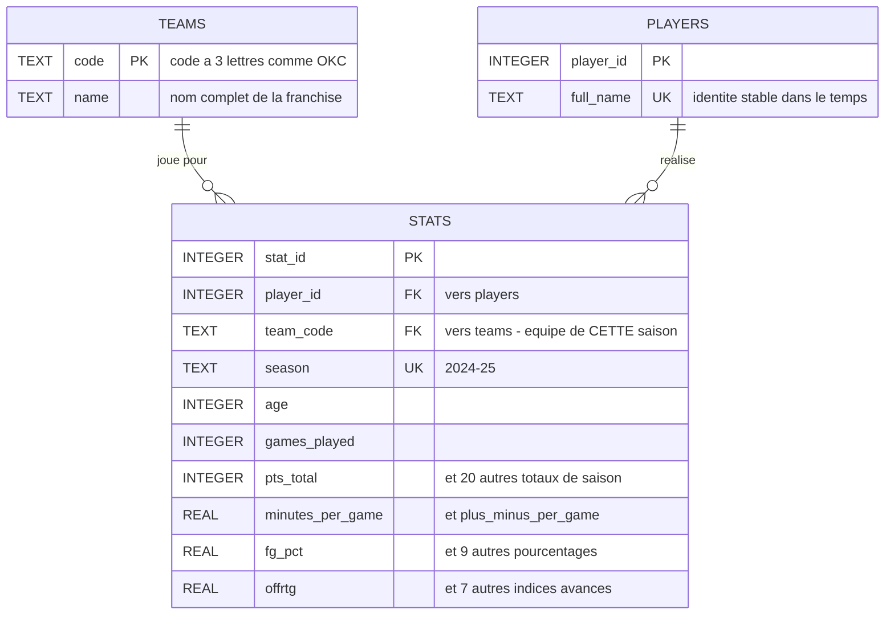

# Projet 10 — Assistant IA d'analyse de performance NBA (SportSee)

## Contexte

SportSee est une startup spécialisée dans l'IA appliquée à l'analyse de performance sportive. Ce projet fait évoluer un prototype d'assistant conversationnel (RAG + Mistral) pour qu'il puisse répondre de façon fiable à des questions analytiques précises sur des statistiques NBA (ex. *"Quel joueur a le meilleur pourcentage de réussite à 3 points sur les 5 derniers matchs ?"*), et pas seulement à des questions générales sur du contenu textuel.

## Installation (environnement reproductible avec uv)

Le projet est géré avec [uv](https://docs.astral.sh/uv/) — `pyproject.toml` et `uv.lock` remplacent volontairement un `requirements.txt` classique : ils figent aussi les dépendances transitives (ce qu'un simple `requirements.txt` ne garantit pas), tout en restant équivalents pour l'installation.

```bash
# 1. Installer les dépendances dans un environnement virtuel dédié (.venv)
uv sync

# 2. Configurer la clé API Mistral
# Créer un fichier .env à la racine avec :
# MISTRAL_API_KEY="votre_clé"
# (clé à obtenir sur https://console.mistral.ai/)
```

Python 3.11 est pinné (`.python-version`) — version choisie pour la compatibilité de l'écosystème ML (`faiss-cpu`, `torch`/`easyocr` n'ont pas encore de wheels pour les versions Python les plus récentes).

## Lancer le projet

```bash
# Construire/reconstruire l'index vectoriel à partir des documents dans data/inputs/
uv run python scripts/index.py

# Lancer l'application Streamlit
uv run streamlit run app/chat.py
```

## Structure du dépôt

```
.
├── data/
│   ├── inputs/           # documents sources (PDF, Excel...)
│   └── vector_db/        # index FAISS + chunks générés par scripts/index.py
├── scripts/
│   └── index.py            # script CLI d'indexation
├── src/                    # code source réutilisable (importé par scripts/ et app/)
│   ├── config.py
│   ├── loading/
│   │   └── loaders.py       # extraction multi-format (PDF/OCR, DOCX, TXT, CSV, Excel)
│   └── rag/
│       └── vector_store.py  # FAISS + embeddings Mistral
├── app/
│   └── chat.py              # interface Streamlit
├── pyproject.toml          # dépendances et métadonnées du projet (uv)
├── uv.lock                 # versions verrouillées (reproductibilité)
└── P10_DSML/                # prototype de référence fourni par Sarah (local uniquement, non versionné)
```

`P10_DSML/` est volontairement absent du dépôt git (`.gitignore`) : c'est le prototype d'origine, conservé intact en local comme référence, jamais modifié directement. Le contenu de `data/`, `scripts/`, `src/` et `app/` en a été repris (copié puis adapté a minima : imports et deux correctifs d'environnement — voir plus bas), pas réécrit à ce stade.

## Analyse du prototype de référence (P10_DSML)

Le prototype fourni est un pipeline RAG texte classique :

| Fichier | Rôle |
|---|---|
| `utils/config.py` | Configuration centralisée (clé API, modèles Mistral, taille de chunks, chemins) |
| `utils/data_loader.py` | Extraction de texte multi-formats (PDF avec fallback OCR, DOCX, TXT, CSV, Excel) |
| `utils/vector_store.py` (`VectorStoreManager`) | Découpage en chunks, génération d'embeddings (`mistral-embed`), index FAISS (`IndexFlatIP`, similarité cosinus), recherche top-k |
| `indexer.py` | Script CLI orchestrant l'indexation complète (chargement → chunking → embeddings → sauvegarde) |
| `MistralChat.py` | Interface Streamlit : question → recherche vectorielle → contexte injecté dans un prompt → génération (`mistral-small-latest`) |

**Données sources** : 4 PDF de discussions Reddit (contenu narratif) + 1 fichier Excel `regular NBA.xlsx` (statistiques de matchs, données structurées).

### Limite diagnostiquée

Le fichier Excel de statistiques est traité comme du texte brut chunké (`df.to_string()` puis découpage par caractères), au même titre que les PDF Reddit. Testé en conditions réelles sur les questions cibles de la mission :

- La récupération sémantique fonctionne bien sur le contenu narratif (PDF Reddit) : réponses correctement sourcées.
- Sur les questions analytiques nécessitant un calcul (ex. % de réussite à 3 points sur les 5 derniers matchs), le modèle ne retrouve pas de données exploitables dans les chunks Excel, et complète sa réponse avec des chiffres qui ne proviennent pas des données réelles de SportSee (connaissances générales du modèle, non vérifiables, potentiellement fausses) — sans le signaler clairement à l'utilisateur.

Cette limite oriente la conception de l'architecture cible : la recherche sémantique par similarité de texte n'est pas adaptée pour répondre à des questions nécessitant filtrage/agrégation sur des données structurées.

### Correctifs d'environnement appliqués lors de la reprise du code

Deux problèmes indépendants de la logique métier ont dû être corrigés pour que le code fonctionne (nécessaires sur cette machine, pas des choix de conception) :

- **TLS** (`src/rag/vector_store.py`) : les appels à l'API Mistral échouaient (`CERTIFICATE_VERIFY_FAILED`) derrière le proxy/antivirus local qui inspecte le trafic HTTPS. Corrigé via [`truststore`](https://github.com/sethmlarson/truststore), qui fait confiance au magasin de certificats du système plutôt qu'au bundle `certifi` embarqué.
- **Encodage console Windows** (`src/loading/loaders.py`) : les barres de progression d'EasyOCR (caractères Unicode `█`) faisaient planter l'initialisation de l'OCR sur la console Windows par défaut (non-UTF-8), empêchant toute extraction des PDF scannés. Corrigé en forçant `stdout`/`stderr` en UTF-8 au démarrage.

## Base de données relationnelle (`data/nba.db`)

Construite depuis `regular NBA.xlsx` par `uv run python scripts/load_excel_to_db.py`. Elle est **entièrement régénérable**, donc gitignorée comme l'index vectoriel. SQLite a été retenu pour le faible volume (599 lignes), l'usage mono-utilisateur en lecture, et l'absence de serveur à déployer ; SQLAlchemy garde l'architecture portable vers PostgreSQL par simple changement d'URL.



### Les clés

| Relation | Signification |
|---|---|
| `stats.player_id` → `players.player_id` | de qui sont ces statistiques |
| `stats.team_code` → `teams.code` | dans quelle équipe, **cette saison-là** |
| `UNIQUE (player_id, season)` | définit le grain : une ligne = un joueur sur une saison |

`stats` est la seule table qui pointe vers les autres : elle porte les faits, `teams` et `players` sont des tables de référence. L'équipe et l'âge sont sur `stats` et non sur `players`, parce qu'ils changent d'une saison à l'autre.

### Conventions de nommage

Le fichier source mélange les unités sans le documenter — son dictionnaire annonce « en moyenne par match » pour des colonnes qui sont en réalité des totaux. Les suffixes lèvent l'ambiguïté :

| Suffixe | Sens | Exemple (SGA) |
|---|---|---|
| `_total` | agrégat de la saison | `pts_total` = 2485 |
| `_per_game` | moyenne par match | `minutes_per_game` = 34,2 |
| `_pct` | pourcentage 0-100 | `fg_pct` = 51,9 |
| *aucun* | indice déjà normalisé | `offrtg` = 122 |

C'est une précaution nécessaire : ces noms seront injectés dans le prompt du tool SQL, et une colonne `pts` ambiguë produirait des réponses du type *« SGA marque 2485 points par match »*.

### Anomalies des données source, corrigées ou documentées

- **Colonne `3PM`** : Excel a interprété l'en-tête comme l'horaire « 3 PM » et l'a stocké en `datetime.time(15, 0)`. Seul le nom était perdu — les valeurs sont intactes. Renommée à l'ingestion en `three_pm_total`, avec un contrôle permanent (`three_pm ≤ three_pa`) qui arrêterait l'ingestion si un futur export décalait les colonnes.
- **Pourcentages** : `fg_pct` **n'est pas** `fgm_total / fga_total`. L'écart diminue quand le volume augmente, signature d'une moyenne des pourcentages match par match. Les deux valeurs sont justes, elles ne mesurent pas la même chose — à ne pas recalculer.
- **Totaux dérivés** : ~95 % se reconstruisent par `round(moyenne par match, 1) × matchs joués`, d'où une imprécision d'environ 0,3 %.
- **`reb_total` ≠ `oreb_total` + `dreb_total`** dans ce fichier.

### Requêtes types

Les trois tableaux d'analyse du classeur (*Analyse de la saison*, *Analyse d'une équipe*, *Top 15 des joueurs en points*) sont des **agrégats dérivés** de la feuille `Données NBA` — ils ne deviennent donc pas des tables, mais des requêtes :

```sql
-- Top 15 des marqueurs
SELECT p.full_name, s.pts_total
FROM stats s JOIN players p USING (player_id)
ORDER BY s.pts_total DESC LIMIT 15;

-- Analyse d'une équipe
SELECT p.full_name, s.pts_total, s.reb_total, s.ast_total
FROM stats s JOIN players p USING (player_id)
JOIN teams t ON t.code = s.team_code
WHERE t.name = 'Detroit Pistons';

-- Total de points par équipe sur la saison
SELECT t.name, SUM(s.pts_total) AS points
FROM stats s JOIN teams t ON t.code = s.team_code
GROUP BY t.name ORDER BY points DESC;
```

### Tables non alimentées

La consigne prévoit également `matches` et `reports`. `matches` **n'est pas constructible** : les sources ne contiennent aucune granularité par match (ni date, ni adversaire, ni identifiant de rencontre) — uniquement des agrégats de saison. C'est aussi ce qui rend les questions domicile/extérieur sans réponse calculable, conformément aux cas B1 et B2 du jeu de test. `reports` reste en attente d'une décision sur son contenu.

## Tool SQL

Les questions chiffrées ne passent plus par la recherche vectorielle seule : l'agent
dispose d'un tool qui interroge directement la base. Il reçoit le schéma et quelques
exemples de requêtes dans la description du tool, écrit le SQL, et le tool l'exécute.

### Exécution : pourquoi pas le tool SQL de LangChain

`SQLDatabase` de LangChain sert ici à **décrire** le schéma (`get_table_info()`), mais
l'exécution passe par [`src/rag/sql_tool.py`](src/rag/sql_tool.py) et non par
`QuerySQLDatabaseTool`. Ce dernier ouvre la base en lecture/écriture et exécute tel quel
le SQL produit par le modèle, sans autoriseur ni délai d'exécution.

C'est un modèle de langage qui écrit ces requêtes : la protection ne repose donc pas sur
une inspection du texte, contournable, mais sur quatre barrières dont trois appliquées
par SQLite lui-même.

| Barrière | Mécanisme | Ce qu'elle arrête |
|---|---|---|
| Lecture seule | `file:...?mode=ro` | toute écriture, quelle que soit la requête |
| Autoriseur | `set_authorizer` | PRAGMA, ATTACH, CTE récursives, `load_extension` |
| Délai | `set_progress_handler` | produits cartésiens et requêtes qui n'aboutissent pas |
| Limites de taille | `LIMIT` + `SQLITE_LIMIT_LENGTH` | résultats et valeurs qui satureraient le prompt |

Une requête rejetée n'interrompt pas le run : son message remonte au modèle via
`ModelRetry`, qui corrige sa requête et réessaie. Les messages distinguent donc les cas
(« invalide : no such column » ≠ « refusée »), car c'est sur eux que le modèle se corrige.

### Traçabilité

`AnswerWithSQL.sql_queries` contient les requêtes **réellement exécutées**, relevées par
le code dans la trace du run — jamais déclarées par le modèle. Une requête affichée dans
l'interface ou enregistrée dans les résultats d'évaluation a donc forcément tourné sur la
base. Même principe que `citations`, vérifiées en Python plutôt qu'auto-déclarées.

## État d'avancement

- [x] Environnement reproductible (uv, Python 3.11)
- [x] Prototype de référence testé et diagnostiqué
- [x] Scripts du prototype repris et restructurés (`data/`, `scripts/`, `src/`, `app/`)
- [x] Base relationnelle SQLite et pipeline d'ingestion
- [x] Tool SQL sécurisé, branché à l'agent
- [ ] Réévaluation RAGAS après ajout du tool
