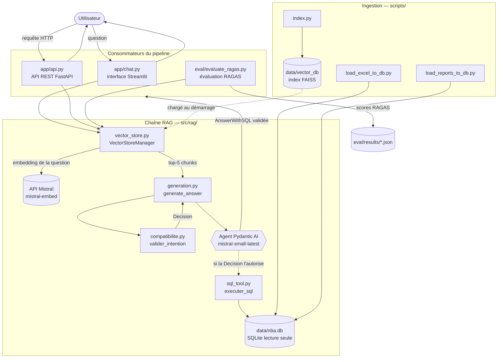
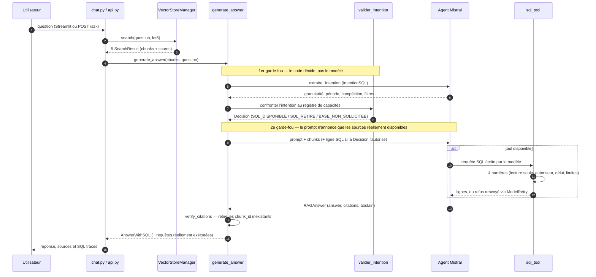
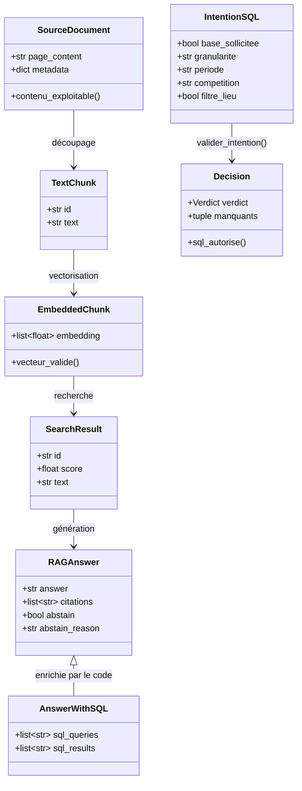
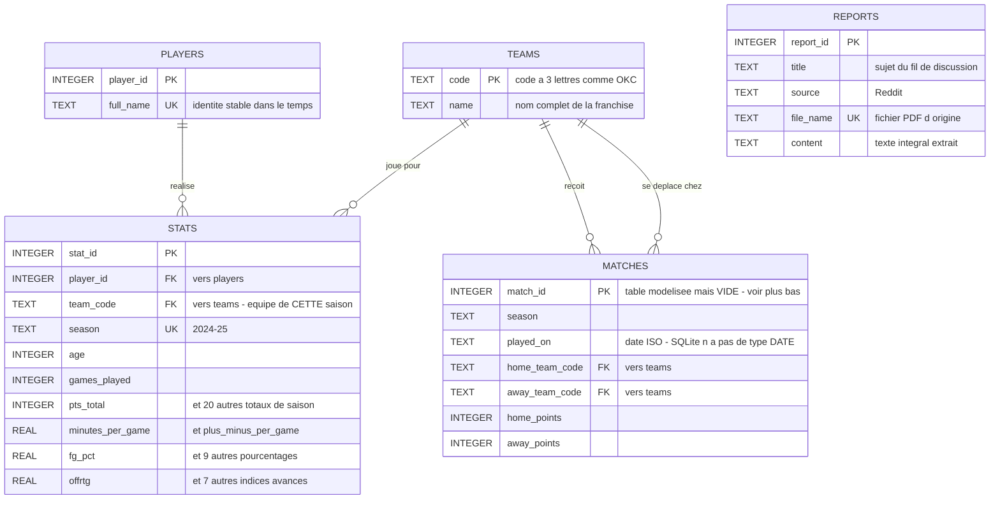

# Projet 10 — Assistant IA d'analyse de performance NBA (SportSee)

## Contexte

SportSee est une startup spécialisée dans l'IA appliquée à l'analyse de performance sportive. Ce projet fait évoluer un prototype d'assistant conversationnel (RAG + Mistral) pour qu'il puisse répondre de façon fiable à des questions analytiques précises sur des statistiques NBA (ex. *"Quel joueur a le meilleur pourcentage de réussite à 3 points sur les 5 derniers matchs ?"*), et pas seulement à des questions générales sur du contenu textuel.

## Démarrage rapide

Depuis un dépôt fraîchement cloné :

```bash
uv sync                                       # 1. dépendances (dans .venv)
echo 'MISTRAL_API_KEY="votre_clé"' > .env     # 2. clé Mistral
uv run python scripts/index.py                # 3. index vectoriel FAISS
uv run python scripts/load_excel_to_db.py     # 4. base statistique...
uv run python scripts/load_reports_to_db.py   #    ...et les 4 PDF Reddit

uv run streamlit run app/chat.py              # 5a. interface conversationnelle
uv run uvicorn app.api:app --reload           # 5b. ou l'API REST, sur /docs
```

Les étapes 3 et 4 ne sont à refaire que si `data/inputs/` change : leurs sorties sont
régénérables, donc non versionnées. L'indexation est la plus longue — embeddings par lots
de 32, plus l'OCR si un PDF n'est pas textuel.

**Vérifier sans rien dépenser** : `uv run pytest` (146 tests, aucun appel réseau), puis
http://localhost:8000/ready une fois l'API lancée.

### Prérequis

| | |
|---|---|
| Python 3.11 | fixé par `.python-version` — `faiss-cpu` et `easyocr` n'ont pas de wheels au-delà |
| [uv](https://docs.astral.sh/uv/) | `pyproject.toml` + `uv.lock` figent aussi les dépendances transitives, ce qu'un `requirements.txt` ne garantit pas |
| Clé Mistral | [console.mistral.ai](https://console.mistral.ai/) — embeddings et génération |
| Clé OpenAI | uniquement pour rejouer l'évaluation RAGAS : le juge est gpt-4o |

Derrière un proxy qui inspecte le TLS, ajoutez `--system-certs` aux commandes `uv`.
Côté Python, `truststore` s'en charge déjà.

## Architecture

Le système répond à une question en croisant **deux sources** : un index vectoriel pour le
qualitatif (discussions Reddit) et une base relationnelle pour le chiffré (statistiques NBA).
Deux garde-fous déterministes encadrent la branche chiffrée.

### Vue d'ensemble



Les **trois consommateurs** appellent `generate_answer()` à l'identique : deux interfaces
utilisateur et le banc d'évaluation. Aucun ne porte de règle métier.

### Le parcours d'une question



### Schéma de la base relationnelle

Cinq tables, dont `matches` **modélisée mais vide** (aucune source ne permet de l'alimenter) et
`reports` **masquée au tool SQL**. Le diagramme entité-association détaillé, avec les types
SQLite réels et les clés, se trouve dans la section
[Base de données relationnelle](#base-de-données-relationnelle-datanbadb).

### Contrats de données

Chaque étape du pipeline produit un objet validé par Pydantic. Une donnée invalide s'arrête à
la frontière où elle apparaît, au lieu de se propager.



`AnswerWithSQL` **hérite** de `RAGAnswer` au lieu d'ajouter un champ : le modèle ne reçoit que
le schéma de `RAGAnswer`, il ne peut donc pas déclarer lui-même les requêtes qu'il a exécutées.
C'est le code qui les renseigne depuis la trace.

## Méthodologie

Le prototype traitait le classeur Excel comme du texte — `df.to_string()` puis découpage
en chunks, au même titre que les PDF. Sur les questions narratives il répondait bien ;
sur les questions chiffrées il ne retrouvait rien d'exploitable et **complétait avec des
chiffres qui ne venaient pas des données**, sans le signaler. Une recherche par
similarité ne sait ni filtrer ni agréger.

Quatre couches ont été ajoutées, **chacune mesurée avant la suivante** :

| Couche | Ce qu'elle apporte | Ce qu'elle ne suffit pas à régler |
|---|---|---|
| **1. Sortie structurée Pydantic** | `RAGAnswer` valide la forme, `verify_citations()` écarte en code les `chunk_id` inventés, `abstain` rend le refus explicite | abstentions à tort, et toujours aucun calcul |
| **2. Tool SQL** | la base entière au lieu de 5 chunks, sous [quatre barrières](#tool-sql) | des requêtes **valides qui répondent à une autre question** |
| **3. Validateur de couverture** | un agent décrit ce que la question demande à la base, le **code** le confronte au schéma et retire le tool si une dimension manque | il dépend d'une extraction faillible |
| **4. Cadrage des sources** | le prompt nomme les sources disponibles et interdit d'en sortir | une consigne reste une consigne |

### Le principe directeur

> **Une consigne dans le prompt ne contraint rien.**

La description du tool avertissait que les données n'ont « aucune granularité par match :
ni date, ni adversaire, ni indicateur domicile/extérieur ». Trois questions ont produit
leur requête malgré cet avertissement, et obtenu des chiffres plausibles pour une question
qu'on n'avait pas posée.

D'où le choix de faire trancher le **code** partout où c'est possible : l'autoriseur
SQLite refuse les écritures sans consulter le modèle, `verify_citations()` écarte une
citation inventée, `sql_queries` est relevé dans la trace d'exécution, et le validateur
**retire le tool** au lieu de demander au modèle de s'abstenir.

Le modèle décrit ; le code décide.

### Ce qui est mesuré

**24 questions** ([`eval/testset.json`](eval/testset.json)) : 8 simples, 8 complexes,
8 bruitées — et 9 sur le classeur, 9 sur les fils Reddit, 6 hybrides exigeant les deux
sources. Deux axes délibérément complémentaires : les **4 métriques RAGAS** jugées par
gpt-4o, et un **axe comportemental déterministe** — le système s'abstient-il quand il le
doit ? Seul le second échappe à la variance du juge, mesurée à ±0.05.

Quatre runs versionnés, un par couche. Résultats détaillés dans
[`eval/analyze_results.ipynb`](eval/analyze_results.ipynb) et dans le rapport.

## Structure du dépôt

```
.
├── app/                            # les deux interfaces, sans aucune règle métier
│   ├── chat.py                     # interface Streamlit
│   └── api.py                      # API REST FastAPI (5 endpoints)
├── src/                            # code réutilisable, importé par app/, scripts/ et eval/
│   ├── config.py                   # clés, modèles, chemins, SEARCH_K
│   ├── schemas.py                  # 11 contrats Pydantic du pipeline
│   ├── db_models.py                # tables SQLAlchemy (players, stats, teams, matches, reports)
│   ├── loading/
│   │   └── loaders.py              # extraction multi-format (PDF/OCR, DOCX, TXT, CSV, Excel)
│   └── rag/
│       ├── vector_store.py         # FAISS + embeddings Mistral (VectorStoreManager)
│       ├── generation.py           # agent Pydantic AI, prompts, assemblage, verify_citations
│       ├── compatibilite.py        # validateur question ↔ schéma (registre de capacités)
│       └── sql_tool.py             # exécution SQL sous 4 barrières SQLite
├── scripts/
│   ├── index.py                    # construit l'index vectoriel
│   ├── load_excel_to_db.py         # peuple players / stats / teams depuis le classeur
│   └── load_reports_to_db.py       # peuple reports depuis les PDF Reddit
├── notebooks/
│   └── explore_nba_excel.ipynb     # exploration du classeur : c'est lui qui a mis au
│                                   # jour l'en-tête 3PM corrompu et les FG% incohérents
├── eval/
│   ├── testset.json                # 24 cas : 8 simples / 8 complexes / 8 bruités
│   ├── evaluate_ragas.py           # exécute le système et le fait juger par RAGAS
│   ├── analyze_results.ipynb       # analyse et comparaison des runs
│   └── results/                    # un JSON par run (baseline, pydantic, tool_sql, guardrails)
├── tests/                          # 146 tests gratuits + 41 marqués api / slow
│   └── test_api.py                 # l'API testée sans un seul appel payant
├── docs/                           # le rapport d'évaluation, publié par MkDocs
│   ├── index.md                    # synthèse et sommaire
│   ├── methodologie.md             # diagnostic, principe directeur, les 4 couches
│   ├── evaluation.md               # jeu de test, métriques, protocole
│   ├── resultats.md                # les chiffres, run par run
│   ├── interpretation.md           # lecture métier
│   ├── limites.md                  # biais et limites, en trois familles
│   ├── conclusion.md               # conclusion et perspectives
│   └── img/                        # figures produites par analyze_results.ipynb
├── data/
│   ├── inputs/                     # documents sources (4 PDF Reddit + regular NBA.xlsx)
│   ├── vector_db/                  # index FAISS + chunks (régénérable)
│   └── nba.db                      # base SQLite (régénérable)
├── mkdocs.yml                      # configuration du site de documentation
├── README.md                       # ce fichier : usage, architecture, procédures
├── pyproject.toml                  # dépendances et configuration pytest (uv)
├── uv.lock                         # versions verrouillées, transitives comprises
└── P10_DSML/                       # prototype de référence, local uniquement, non versionné
```

`data/vector_db/`, `data/nba.db` et `site/` sont **gitignorés** : les deux premiers se
reconstruisent depuis `data/inputs/` par les trois scripts d'ingestion, le troisième par
`mkdocs build`. Seules les sources sont versionnées.

`P10_DSML/` est volontairement absent du dépôt git : c'est le prototype d'origine, conservé
intact en local comme référence, jamais modifié directement.

## Reprise du prototype (`P10_DSML`)

Le prototype d'origine est conservé intact en local, jamais modifié, et exclu du dépôt
(`.gitignore`). Son code a été repris puis restructuré vers `src/`, `scripts/` et `app/`.

Deux correctifs d'environnement, sans rapport avec la logique métier, ont été nécessaires
pour qu'il fonctionne :

- **TLS** — les appels à l'API Mistral échouaient (`CERTIFICATE_VERIFY_FAILED`) derrière
  un proxy inspectant le HTTPS. Corrigé par [`truststore`](https://github.com/sethmlarson/truststore),
  qui fait confiance au magasin de certificats du système.
- **Encodage console Windows** — les barres de progression d'EasyOCR (`█`) faisaient
  planter l'OCR sur une console non-UTF-8. Corrigé en forçant `stdout`/`stderr` en UTF-8.

## Base de données relationnelle (`data/nba.db`)

Construite depuis `regular NBA.xlsx` par `scripts/load_excel_to_db.py`, **entièrement
régénérable**, donc gitignorée comme l'index vectoriel. SQLite pour le faible volume
(599 lignes), l'usage mono-utilisateur en lecture et l'absence de serveur ; SQLAlchemy
garde l'architecture portable vers PostgreSQL par simple changement d'URL.



Quatre décisions de modélisation, détaillées dans le rapport :

- **`stats` est séparée de `players`** : un joueur transféré change d'équipe en cours de
  saison. La clé fonctionnelle est `(player_id, season)`, pas le joueur seul.
- **`matches` est modélisée mais vide** : la consigne demande de la modéliser, mais le
  classeur ne contient que des agrégats de saison — ni date, ni adversaire, ni
  identifiant de rencontre, vérifié sur les 47 colonnes.
- **`reports` n'a aucune clé étrangère** : rien dans ces discussions ne se rattache de
  façon fiable à un joueur identifié. Les rattacher demanderait une extraction d'entités,
  qui introduirait ses propres erreurs.
- **`reports` et `matches` sont masquées au tool SQL** — une table vide ou redondante
  avec l'index vectoriel n'a rien à faire dans le schéma présenté au modèle.

Le classeur portait deux anomalies, conservées et documentées plutôt que corrigées en
silence : un en-tête `3PM` réinterprété par Excel en horaire (`15:00`), et des `FG%`
incohérents pour les joueurs à faible temps de jeu.

## Tool SQL

Les questions chiffrées ne passent plus par la recherche vectorielle seule : l'agent
dispose d'un tool qui interroge la base. Il reçoit le schéma, écrit le SQL, le tool
l'exécute — sous quatre barrières, dont trois appliquées par SQLite lui-même.

| Barrière | Mécanisme | Ce qu'elle arrête |
|---|---|---|
| Lecture seule | `file:...?mode=ro` | toute écriture, quelle que soit la requête |
| Autoriseur | `set_authorizer` | PRAGMA, ATTACH, CTE récursives, `load_extension` |
| Délai | `set_progress_handler` | produits cartésiens et requêtes qui n'aboutissent pas |
| Limites de taille | `LIMIT` + `SQLITE_LIMIT_LENGTH` | résultats qui satureraient le prompt |

C'est un modèle de langage qui écrit ces requêtes : la protection ne repose donc pas sur
une inspection du texte, contournable, mais sur le moteur. L'exécution passe par
[`src/rag/sql_tool.py`](src/rag/sql_tool.py) et non par `QuerySQLDatabaseTool` de
LangChain, qui ouvre la base en lecture/écriture et exécute tel quel — `SQLDatabase` n'y
sert qu'à **décrire** le schéma.

Une requête rejetée n'interrompt pas le run : son message remonte au modèle via
`ModelRetry`, qui corrige et réessaie.

**Traçabilité** — `AnswerWithSQL.sql_queries` contient les requêtes **réellement
exécutées**, relevées par le code dans la trace, jamais déclarées par le modèle. Même
principe que `citations`, vérifiées en Python plutôt qu'auto-déclarées.

## API REST

FastAPI ([`app/api.py`](app/api.py)), à côté de l'interface Streamlit. Les deux appellent
`generate_answer()` à l'identique : aucune règle métier dans la couche HTTP.

```bash
uv run uvicorn app.api:app --reload
```

**Documentation interactive** : http://localhost:8000/docs — générée par FastAPI depuis
les modèles Pydantic, elle permet d'essayer chaque endpoint sans écrire de commande.

| Méthode | Chemin | Rôle | Coût |
|---|---|---|---|
| `GET` | `/` | identité du service et liste des endpoints | gratuit |
| `GET` | `/health` | le processus répond (*liveness*) | gratuit |
| `GET` | `/ready` | index, base et clé API opérationnels (*readiness*) | gratuit |
| `POST` | `/ask` | poser une question | **appels Mistral** |
| `GET` | `/logs` | les 100 derniers appels et leurs latences | gratuit |

`/health` prouve que le processus est debout, `/ready` que les trois dépendances
répondent. C'est `/ready` qu'un orchestrateur interroge avant de router du trafic.

### `POST /ask`

```bash
curl -X POST http://localhost:8000/ask      -H "Content-Type: application/json"      -d '{"question": "Combien de points Nikola Jokić a-t-il marqués cette saison ?"}'
```

**Requête** — `question` entre 3 et 500 caractères ; hors bornes, Pydantic rend un `422`
sans que la question atteigne le modèle, elle ne coûte donc rien.

```json
{ "question": "Combien de points Nikola Jokić a-t-il marqués cette saison ?" }
```

**Réponse `200`**

```json
{
  "reponse": {
    "answer": "Nikola Jokić a marqué 2072 points cette saison.",
    "citations": [],
    "abstain": false,
    "abstain_reason": null,
    "sql_queries": ["SELECT s.pts_total FROM stats s JOIN players p USING (player_id) WHERE p.full_name = 'Nikola Jokić';"],
    "sql_results": ["pts_total
2072"]
  },
  "latence_ms": { "recherche": 343.0, "generation": 2270.4, "total": 2613.4 }
}
```

`sql_queries` contient les requêtes **réellement exécutées**, relevées dans la trace du
run : une requête qui y figure a forcément tourné sur la base.

### Codes de retour

| Code | Quand |
|---|---|
| `200` | réponse produite — **une abstention en fait partie**, avec `abstain: true` et sa raison |
| `422` | question absente, vide ou hors des bornes 3-500 |
| `404` / `405` | chemin inconnu / mauvaise méthode |
| `500` | panne pendant la génération |
| `503` | index vectoriel non chargé |

Tous rendent un corps de la même forme : `{"detail": ...}`.

### `GET /logs`

Les 100 derniers appels, du plus récent au plus ancien : question, requêtes SQL exécutées,
citations retenues, issue et décomposition des latences.

```bash
curl "http://localhost:8000/logs?limit=5"
```

```json
[{
  "horodatage": "2026-09-25T12:17:15Z",
  "issue_appel": "abouti",
  "question": "Compare les rebonds à domicile et à l'extérieur.",
  "base_interrogee": false,
  "requetes_sql": [],
  "citations": ["0_3"],
  "abstention": true,
  "abstain_reason": "Aucun indicateur domicile/extérieur dans la base.",
  "latence_ms": { "recherche": 210.0, "generation": 1840.2, "total": 2050.2 },
  "extrait_reponse": "Les données ne permettent pas de distinguer...",
  "erreur": null,
  "trace_id": "01a0d8dd622a8e518474bf19e41d5641"
}]
```

`issue_appel` dit si le traitement est allé au bout, **pas** si la réponse est bonne : une
abstention est donc `abouti`. Le `trace_id` mène à la trace Logfire complète de l'appel.

**Deux limites assumées** : le journal est volatile (un redémarrage l'efface, chaque
worker ne voit que ses propres appels) et non authentifié — il expose questions et
réponses, à protéger avant tout déploiement.

## Observabilité

Deux dispositifs complémentaires, actifs sans configuration.

**Logfire** produit des traces structurées — des spans avec des attributs typés, au
format OpenTelemetry. L'instrumentation est automatique pour l'agent
(`logfire.instrument_pydantic_ai()`) et pour l'API (`logfire.instrument_fastapi()`), et
deux spans sont posés à la main là où le code est spécifique :

| Span | Attributs relevés |
|---|---|
| `faiss_retrieval` | `query`, `k`, `num_results`, `chunk_ids` |
| `sql_tool` | `sql.query`, `sql.rows_returned`, `sql.execution_ms`, `sql.truncated`, `sql.refused` |

Une trace montre donc, pour une question : la récupération, la classification
d'intention, la décision de couverture, chaque appel de modèle et chaque requête SQL
avec sa durée.

`send_to_logfire="if-token-present"` : **rien n'est envoyé** tant qu'aucun token n'est
configuré. Le code tourne à l'identique sans compte Logfire.

**Le module `logging`** complète en texte : étapes d'ingestion, décision de couverture,
citations invalides écartées, requêtes refusées. Format uniforme
`horodatage - niveau - module - message`.

Côté API, `GET /logs` donne une vue immédiate des 100 derniers appels avec leurs
latences, et chaque entrée porte le `trace_id` qui mène à la trace Logfire complète.

## Évaluation

Deux dispositifs à ne pas confondre : les **tests** vérifient que le code fait ce qu'on
attend, l'**évaluation RAGAS** mesure la qualité des réponses.

```bash
uv run pytest            # 146 tests gratuits, aucun appel réseau, quelques secondes
uv run pytest -m api     # 40 tests appelant réellement Mistral — PAYANT
uv run pytest -m slow    # 1 test chargeant le modèle OCR — lent
```

Les trois suites tournent dans des **processus séparés** : importer `torch` après `ragas`
fait planter l'interpréteur sous Windows (voir le commentaire de `pyproject.toml`).

```bash
uv run python eval/evaluate_ragas.py --label <nom_du_run>
#   --limit 3   n'évaluer que les 3 premiers cas (mise au point)
#   --force     écraser un run portant déjà ce label
#   --pause 5   secondes entre deux cas (défaut : 5)
```

**Prérequis** : `OPENAI_API_KEY` dans `.env` en plus de `MISTRAL_API_KEY` — le système
évalué tourne sous Mistral, le juge RAGAS est gpt-4o. Un run prend une quinzaine de
minutes, la limite de 30 000 tokens/min de gpt-4o étant la contrainte dominante.

Chaque run écrit `eval/results/<label>.json` et **n'écrase jamais** un run existant sans
`--force`. Quatre runs sont versionnés :

| Label | Système évalué |
|---|---|
| `baseline` | prototype d'origine, texte libre, aucune validation |
| `validation_pydantic` | + sortie structurée, citations vérifiées, abstention |
| `tool_sql` | + tool SQL, testset porté à 24 cas |
| `guardrails` | + validateur de couverture et cadrage des sources |

L'analyse comparative vit dans [`eval/analyze_results.ipynb`](eval/analyze_results.ipynb) :
chaque run analysé seul, puis comparés sur les cas communs, les cas hybrides et les tests
de robustesse. Le notebook reste exécutable même si des runs manquent.

## Rapport d'évaluation

L'analyse complète — méthodologie, résultats, lecture métier, limites et perspectives —
vit dans [`docs/`](docs/), publiée comme **site MkDocs**.

| Page | Contenu |
|---|---|
| [Synthèse](docs/index.md) | le problème, ce qui a été fait, les trois résultats à retenir |
| [Contexte et méthodologie](docs/methodologie.md) | le diagnostic et les quatre couches, argumentées |
| [Protocole d'évaluation](docs/evaluation.md) | jeu de test, métriques, et pourquoi deux axes |
| [Résultats](docs/resultats.md) | les chiffres, run par run et catégorie par catégorie |
| [Lecture métier](docs/interpretation.md) | ce que chaque défaillance coûte à SportSee |
| [Limites et biais](docs/limites.md) | ce que cette évaluation ne peut pas établir |
| [Conclusion et perspectives](docs/conclusion.md) | six chantiers, par ordre de ce qu'ils débloquent |

Les sept pages se lisent telles quelles sur GitHub. Le site ajoute la navigation, la
recherche plein texte et le rendu des diagrammes.

### Consulter le site

```bash
# NO_MKDOCS_2_WARNING éteint l'avis que Material affiche sur la future version 2.0 de
# MkDocs : il porte sur l'écosystème, pas sur ce projet, qui reste figé en 1.6.1.
export NO_MKDOCS_2_WARNING=1

uv run mkdocs serve      # aperçu sur http://localhost:8000, rechargé à chaque modification
uv run mkdocs build      # site statique dans site/ (gitignoré)
uv run mkdocs gh-deploy  # publication sur GitHub Pages
```

`mkdocs-material` est déclaré dans le **groupe `docs`** de `pyproject.toml`, pas dans les
dépendances du projet : le code ne l'importe pas, il ne sert qu'à construire le site.
`uv sync` l'installe avec les autres groupes.

### Ce que la configuration fait

[`mkdocs.yml`](mkdocs.yml) tient en une trentaine de lignes.

| Réglage | Effet |
|---|---|
| `nav` | l'ordre des sept pages — **c'est lui qui numérote les figures** |
| `theme: material`, `language: fr` | sommaire latéral, recherche, interface en français |
| `palette` | bascule clair/sombre ; le clair est le défaut, les figures étant sur fond clair |
| `pymdownx.superfences` | rend les blocs de code `mermaid` comme des diagrammes |
| `toc: permalink` | un lien ancré sur chaque titre, pour citer une section précise |

Les figures sont produites par [`eval/analyze_results.ipynb`](eval/analyze_results.ipynb),
qui les enregistre dans `docs/img/` — là où MkDocs sait les servir. Après un nouveau run,
réexécuter le notebook suffit à les mettre à jour : il reste leur source unique.
