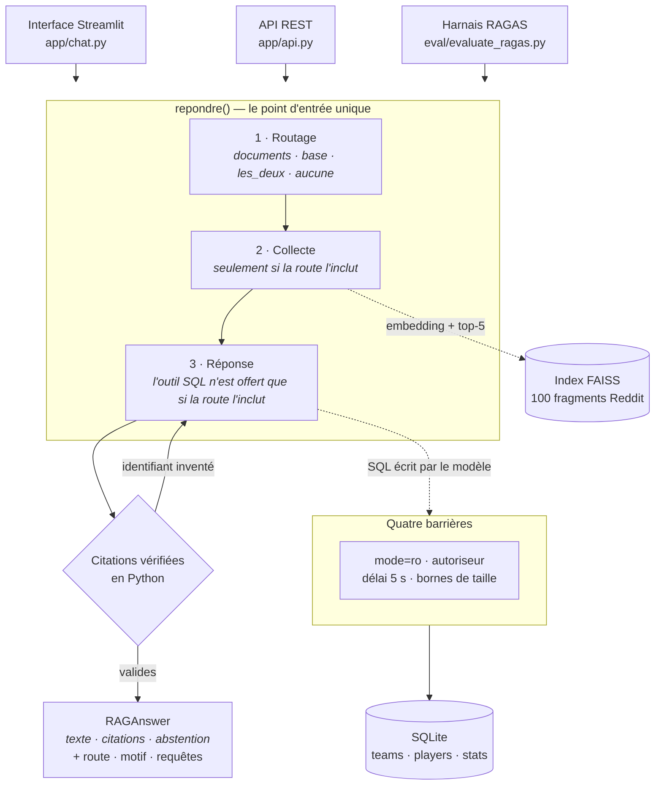
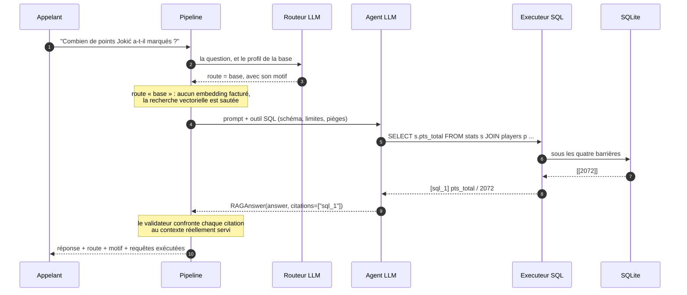
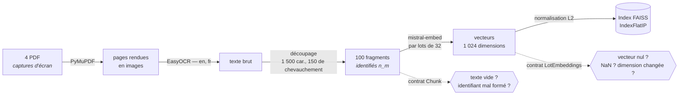
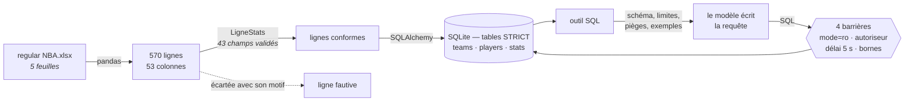
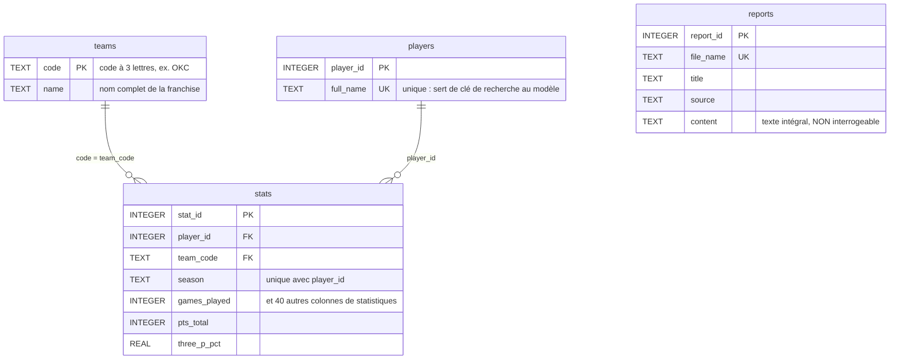

# Assistant NBA — évaluation et renforcement d'un système RAG

Un prototype d'assistant répond à des questions de fans de NBA à partir de deux
sources : quatre fils Reddit et un classeur de statistiques de saison régulière. Ce
dépôt en mesure la fiabilité, puis corrige les défauts que la mesure établit.

Quatre évaluations jalonnent le travail. La dernière mesure l'effet de la base
relationnelle et du routage : **5 chiffres exacts sur 8, contre 0 sur 8 au départ**.

## 1 Installation & lancement

Prérequis : Python ≥ 3.11, [uv](https://docs.astral.sh/uv/), une clé API **Mistral**
(le système évalué) et une clé **OpenAI** (le juge de l'évaluation).

```bash
git clone https://github.com/FaizaKh93/Projet10_mission.git
cd Projet10_mission
uv sync
```

`.env` à la racine :

```
MISTRAL_API_KEY=...
OPENAI_API_KEY=...
```

Les sources sont dans `data/inputs/`. Les PDF sont des captures d'écran de
discussions, donc passés à l'OCR : la première indexation télécharge le modèle EasyOCR
et prend plusieurs minutes.

```bash
uv run python scripts/index.py                # construit data/vector_db/ — appels API facturés
uv run python scripts/load_excel_to_db.py     # tables teams / players / stats
uv run python scripts/load_reports_to_db.py   # table reports — reprend le texte de l'index

uv run streamlit run app/chat.py              # l'assistant, en interface web
uv run uvicorn app.api:app --reload           # le même assistant, en HTTP
```

`data/vector_db/` et `data/nba.db` ne sont pas versionnés : ils se régénèrent.

`load_reports_to_db.py` lit le texte déjà extrait par l'indexation plutôt que de
relancer l'OCR : quelques secondes au lieu d'une dizaine de minutes. L'OCR reste en
recours pour un PDF absent de l'index.

---

## Structure du dépôt

```
app/
  chat.py                   interface Streamlit
  api.py                    API REST FastAPI — mêmes réponses, autre transport
scripts/
  index.py                  construction de l'index vectoriel
  load_excel_to_db.py       classeur → tables teams / players / stats
  load_reports_to_db.py     PDF Reddit → table reports
src/
  config.py                 chemins, modèles, paramètres de découpage et de recherche
  schemas.py                les contrats Pydantic, aux frontières du système
  db_models.py              les quatre tables SQLAlchemy, déclarées STRICT
  loading/loaders.py        extraction du texte (PDF/OCR, Excel, CSV, DOCX, TXT)
  rag/vector_store.py       embeddings, index FAISS, recherche
  rag/sql_tool.py           exécution bridée du SQL écrit par le modèle
  rag/generation.py         contexte, prompt, agent, vérification des citations
  rag/pipeline.py           routage puis collecte puis réponse — le point d'entrée
eval/
  testset.json              les 18 cas
  evaluate_ragas.py         exécution du système + notation RAGAS
  analyze_results.ipynb     analyse des résultats
  results/                  un fichier JSON par run
tests/                      tests unitaires
notebooks/                  exploration des données sources
data/inputs/                PDF Reddit et classeur Excel
```

`src/rag/pipeline.py` est partagé par l'interface et par l'évaluation : le routage, le
prompt et l'appel au modèle n'existent qu'à un seul endroit. Sans cela, l'évaluation
pourrait mesurer autre chose que ce que l'application fait réellement.

---

## 2 Vue d'ensemble du système


```mermaid
flowchart TB
    UI["Interface Streamlit<br/>app/chat.py"]
    API["API REST<br/>app/api.py"]
    EVAL["Harnais RAGAS<br/>eval/evaluate_ragas.py"]

    UI --> PIPE
    API --> PIPE
    EVAL --> PIPE

    subgraph PIPE["repondre() — le point d'entrée unique"]
        direction TB
        R["1 · Routage<br/><i>documents · base · les_deux · aucune</i>"]
        C["2 · Collecte<br/><i>seulement si la route l'inclut</i>"]
        G["3 · Réponse<br/><i>l'outil SQL n'est offert que si la route l'inclut</i>"]
        R --> C --> G
    end

    C -.->|"embedding + top-5"| FAISS[("Index FAISS<br/>100 fragments Reddit")]
    G -.->|"SQL écrit par le modèle"| GARDE

    subgraph GARDE["Quatre barrières"]
        direction LR
        B["mode=ro · autoriseur<br/>délai 5 s · bornes de taille"]
    end

    GARDE --> DB[("SQLite<br/>teams · players · stats")]

    G --> V{"Citations vérifiées<br/>en Python"}
    V -->|"identifiant inventé"| G
    V -->|"valides"| OUT["RAGAnswer<br/><i>texte · citations · abstention</i><br/>+ route · motif · requêtes"]
```

**Le principe qui tient l'ensemble : le modèle propose, le code dispose.** Le routeur
choisit la source mais ne collecte pas ; le modèle écrit le SQL mais ne l'exécute pas ;
il cite ses sources mais ses citations sont vérifiées.

### 2.1 Le parcours d'une question chiffrée


```mermaid
sequenceDiagram
    autonumber
    participant U as Appelant
    participant P as Pipeline
    participant R as Routeur LLM
    participant A as Agent LLM
    participant T as Executeur SQL
    participant D as SQLite

    U->>P: "Combien de points Jokić a-t-il marqués ?"
    P->>R: la question, et le profil de la base
    R-->>P: route = base, avec son motif
    Note over P: route « base » : aucun embedding facturé,<br/>la recherche vectorielle est sautée
    P->>A: prompt + outil SQL (schéma, limites, pièges)
    A->>T: SELECT s.pts_total FROM stats s JOIN players p ...
    T->>D: sous les quatre barrières
    D-->>T: [[2072]]
    T-->>A: [sql_1] pts_total / 2072
    A-->>P: RAGAnswer(answer, citations=["sql_1"])
    Note over P: le validateur confronte chaque citation<br/>au contexte réellement servi
    P-->>U: réponse + route + motif + requêtes exécutées
```

Un seul point d'entrée, [`repondre()`](src/rag/pipeline.py), appelé à l'identique par
l'interface, l'API et l'évaluation : ce qui est mesuré est ce que l'application fait.

### 2.2 Les contrats

Des modèles Pydantic ([src/schemas.py](src/schemas.py)) posés à chaque frontière. Sur
le chemin documentaire :

| Frontière | Ce qui est refusé |
|---|---|
| Documents chargés | extraction vide ou résiduelle, source manquante |
| Fragments découpés | texte vide, identifiant mal formé |
| **Lot d'embeddings** | lot plus court que ses fragments, **vecteur nul**, dimension changée |
| Question | question vide ou démesurée |
| Fragments récupérés | score hors de [-100, 100] |
| **Réponse** | abstention sans motif |

Le chemin chiffré a les siens : une ligne du classeur et un résultat de requête sont
validés de la même manière, au même endroit.

**Les citations ne sont pas prises pour argent comptant.** Un validateur confronte en
Python les identifiants cités au contexte réellement servi, et renvoie le modèle
corriger s'il en invente un. Un contrat Pydantic ne peut pas faire ce contrôle : il ne
connaît pas le contexte du run.

---

## 3 Les sources de données

Deux sources, deux traitements **entièrement différents** — c'est la clé pour
comprendre le reste du dépôt.

| | Quatre fils Reddit | Un classeur de statistiques |
|---|---|---|
| Nature | opinions, débats, jugements de fans | 569 joueurs, saison régulière |
| Préparation | OCR, découpage, vectorisation | lecture, validation, insertion |
| Stockage | index FAISS, 100 fragments | SQLite, 4 tables |
| Interrogation | recherche sémantique, top-5 | SQL écrit par le modèle |
| Sait répondre à | « pourquoi les fans trouvent-ils… » | « combien de points… » |

### 3.1 Les discussions Reddit

Les quatre PDF sont des **captures d'écran** : aucun texte à extraire, seulement des
images. PyMuPDF rend chaque page, EasyOCR la lit en anglais et en français.


```mermaid
flowchart LR
    PDF["4 PDF<br/><i>captures d'écran</i>"] -->|"PyMuPDF"| IMG["pages rendues<br/>en images"]
    IMG -->|"EasyOCR — en, fr"| TXT["texte brut"]
    TXT -->|"découpage<br/>1 500 car., 150 de chevauchement"| CH["100 fragments<br/><i>identifiés n_m</i>"]
    CH -->|"mistral-embed<br/>par lots de 32"| VEC["vecteurs<br/>1 024 dimensions"]
    VEC -->|"normalisation L2"| IDX[("Index FAISS<br/>IndexFlatIP")]

    CH -.->|"contrat Chunk"| G1{{"texte vide ?<br/>identifiant mal formé ?"}}
    VEC -.->|"contrat LotEmbeddings"| G2{{"vecteur nul ?<br/>NaN ? dimension changée ?"}}
```

Les vecteurs sont normalisés avant insertion : leur produit scalaire *est* alors la
similarité cosinus, celle qui a du sens pour du texte.

**Le contrat sur les embeddings est le plus important du dépôt.** Un lot en échec
produisait des vecteurs nuls : bonne longueur, bon alignement, tous les contrôles de
taille franchis — et les fragments devenaient irrécupérables, leur similarité valant 0
pour n'importe quelle question. Sans ce contrat, le défaut ne se voyait nulle part.

**Seuls les PDF sont indexés** (`EXTENSIONS_INDEXEES`). Le classeur en a été retiré sur
mesure : sa feuille de statistiques pesait 47 % de l'index et n'était **jamais**
récupérée — 0 fois sur 90. Une recherche sémantique rapproche « combien de points ? »
d'une phrase qui *définit* le mot points, pas d'une ligne de tableau aplatie.

### 3.2 Le classeur de statistiques

Sur les cinq feuilles du classeur, une seule porte les données brutes. Elle est lue par
pandas, **validée ligne à ligne par Pydantic**, puis insérée par SQLAlchemy.


```mermaid
flowchart LR
    XL["regular NBA.xlsx<br/><i>5 feuilles</i>"] -->|"pandas"| LIG["570 lignes<br/>53 colonnes"]
    LIG -->|"LigneStats<br/><i>43 champs validés</i>"| OK["lignes conformes"]
    LIG -.->|"écartée avec son motif"| KO["ligne fautive"]
    OK -->|"SQLAlchemy"| DB[("SQLite — tables STRICT<br/>teams · players · stats")]

    DB --> TOOL["outil SQL"]
    TOOL -->|"schéma, limites,<br/>pièges, exemples"| LLM["le modèle écrit<br/>la requête"]
    LLM -->|"SQL"| BAR{{"4 barrières<br/>mode=ro · autoriseur<br/>délai 5 s · bornes"}}
    BAR --> DB
```

Une ligne fautive est **écartée avec son motif**, les autres passent : une anomalie
ponctuelle ne doit pas priver la base des 568 autres joueurs. Les tables sont déclarées
**STRICT** — SQLite refuse alors une valeur du mauvais type au lieu de la convertir.

| Table | Contenu | Interrogeable |
|---|---|---|
| `teams` | 30 franchises | oui |
| `players` | 569 joueurs | oui |
| `stats` | 569 lignes × 47 colonnes | oui |
| `reports` | 4 fils Reddit, texte intégral | **non** |


```mermaid
erDiagram
    teams ||--o{ stats : "code = team_code"
    players ||--o{ stats : "player_id"

    teams {
        TEXT code PK "code à 3 lettres, ex. OKC"
        TEXT name "nom complet de la franchise"
    }
    players {
        INTEGER player_id PK
        TEXT full_name UK "unique : sert de clé de recherche au modèle"
    }
    stats {
        INTEGER stat_id PK
        INTEGER player_id FK
        TEXT team_code FK
        TEXT season "unique avec player_id"
        INTEGER games_played "et 40 autres colonnes de statistiques"
        INTEGER pts_total
        REAL three_p_pct
    }
    reports {
        INTEGER report_id PK
        TEXT file_name UK
        TEXT title
        TEXT source
        TEXT content "texte intégral, NON interrogeable"
    }
```

`UNIQUE(player_id, season)` garantit **une ligne par joueur et par saison** — c'est
elle qui rend `MAX(wins_total)` interprétable comme le bilan d'une équipe, là où la
somme multiplierait par l'effectif. `reports` n'a **aucune relation** avec les autres
et n'est pas offerte au modèle : elle double l'index FAISS, et un `LIKE` n'a pas de
sens sémantique.

**Pas de table `matches`.** Le modèle relationnel en prévoyait une, le classeur n'en
contient pas la matière : aucune ligne par match. La créer l'aurait laissée vide, et
une table vide ment — au modèle qui croit pouvoir l'interroger, comme à qui lit le
schéma. Conséquence : pas de date, pas d'adversaire, **pas de distinction
domicile/extérieur**, une seule saison. Ces limites sont **dérivées** par
`profil_capacites()`, jamais recopiées.

L'ingestion est recoupée avec une source extérieure au code : la feuille `Analyse` du
classeur porte ses propres totaux, et la base les reproduit à l'unité près.

#### 3.2.1 L'outil SQL

Le modèle écrit la requête ; [src/rag/sql_tool.py](src/rag/sql_tool.py) l'exécute sans
lui faire confiance. Quatre barrières, dont trois appliquées par SQLite lui-même plutôt
que par inspection du texte — qu'un commentaire ou une CTE contournerait :

| Barrière | Ce qu'elle empêche |
|---|---|
| connexion `mode=ro` | toute écriture, quelle que soit la requête |
| autoriseur SQLite | tout ce qui n'est pas une lecture des tables autorisées |
| gestionnaire de progression | une requête qui dépasse 5 s |
| limites de taille | un résultat ou une cellule qui ferait exploser le prompt |

La liste des tables est **blanche** : une table ajoutée demain sera refusée par défaut,
là où une liste noire l'exposerait.

Ce que le modèle reçoit avec l'outil est **dérivé de la base, jamais écrit à la main** :
le schéma réel, des exemples de requêtes, les limites de la base — et les pièges
d'agrégation. Une recopie manuelle finit toujours par mentir ; et sans le schéma, le
modèle devine les noms de colonnes, puis épuise ses relances.

Une requête refusée n'est pas une erreur fatale : son motif est renvoyé au modèle, qui
corrige et réessaie. Mieux qu'un résultat vide, qu'il interpréterait comme « 0 ».

**Pourquoi pas la chaîne SQL clés en main de LangChain.** `SQLDatabaseToolkit` et
`create_sql_agent` exécutent eux-mêmes la requête du modèle, donc hors des quatre
barrières. LangChain sert ici à ce qu'il fait bien — **décrire** : les `CREATE TABLE`
réels et deux lignes d'exemple par table. L'exécution reste dans `executer_sql()`.

### 3.3 Le choix de la source

Un premier appel au modèle ([src/rag/pipeline.py](src/rag/pipeline.py)) choisit la
source **avant toute collecte**, et rend sa décision *et son motif* — une route est
donc vérifiable après coup.

| Route | Quand | Ce qui est collecté |
|---|---|---|
| `documents` | opinions, débats, commentaires | recherche FAISS |
| `base` | chiffres, totaux, classements | rien — l'outil SQL suffit |
| `les_deux` | identifier quelqu'un *puis* le chiffrer | recherche FAISS **et** outil SQL |
| `aucune` | hors des deux sources | rien |

Sa consigne est construite à chaque appel à partir du profil réel de la base. Le
routeur sait ainsi qu'il n'y a ni granularité par match, ni comparaison entre saisons,
sans que personne ne l'ait écrit. Il décide sur les **limites** de la base, jamais sur
ses colonnes : lui énoncer 47 noms de colonnes ferait basculer vers `base` toute
question contenant un mot statistique.

Quand la route exclut la base, **l'outil SQL n'est pas déconseillé au modèle : il lui
est retiré.** Une consigne dans un prompt ne contraint rien ; l'absence de l'outil, si.
Symétriquement, une route `base` n'engage aucun embedding facturé pour un contexte qui
ne servirait pas.

**Trois limites assumées.** Décider avant de chercher, c'est décider sans savoir ce
qu'on trouvera : l'abstention reste la responsabilité du nœud de réponse. Une panne du
routeur replie sur `les_deux` — une collecte de plus, aucune source perdue. Et le
routage est juste **15 fois sur 18** : les trois erreurs sont des questions formulées
en « combien de… », où l'identification préalable dans les documents est implicite.

---

## 4 L'API REST

Même pipeline que l'interface Streamlit, autre transport : les deux appellent
`repondre()`. Une réponse servie en HTTP est donc celle que l'évaluation mesure.

```bash
uv run uvicorn app.api:app --reload
```

| Endpoint | Rôle |
|---|---|
| `GET /` | identité du service et liste des endpoints |
| `GET /health` | *liveness* — le processus répond, aucune dépendance vérifiée |
| `GET /ready` | *readiness* — index, base et clé API ; **503** si l'une manque |
| `POST /ask` | poser une question |
| `GET /logs` | les 100 derniers appels |

La documentation interactive complète est sur **`/docs`**, générée par FastAPI depuis
les modèles Pydantic — les schémas ne sont donc écrits qu'une fois, dans le code.

### 4.1 Poser une question

```bash
curl -X POST http://localhost:8000/ask \
  -H "Content-Type: application/json" \
  -d '{"question": "Combien de points Nikola Jokić a-t-il marqués cette saison ?"}'
```

```json
{
  "reponse": {
    "answer": "Nikola Jokić a marqué un total de 2 072 points cette saison.",
    "citations": ["sql_1"],
    "abstain": false,
    "abstain_reason": null
  },
  "route": "base",
  "route_motif": "La question demande un chiffre total de points marqués par un joueur sur une saison, ce que la base de données peut fournir.",
  "requetes": [
    {
      "requete": "SELECT s.pts_total FROM stats s JOIN players p ON p.player_id = s.player_id WHERE p.full_name = 'Nikola Jokić'",
      "colonnes": ["pts_total"],
      "lignes": [[2072]],
      "tronque": false
    }
  ],
  "latence_ms": {"total": 1412.6}
}
```

**`route` et `requetes` ne sont pas décoratifs.** Sans eux, l'appelant devrait croire le
modèle sur parole ; avec eux, il peut rejouer la requête et vérifier le chiffre. La
décomposition fine de la latence n'est pas dans la réponse : elle vit dans la trace
Logfire, qui ouvre un span par étape.

### 4.2 Quand la réponse n'existe pas

```bash
curl -X POST http://localhost:8000/ask \
  -H "Content-Type: application/json" \
  -d '{"question": "Combien de points Reggie Miller a-t-il marqués cette saison ?"}'
```

```json
{
  "reponse": {
    "answer": "Je n'ai pas pu trouver Reggie Miller dans la base de données des joueurs.",
    "citations": [],
    "abstain": true,
    "abstain_reason": "Reggie Miller n'apparaît pas dans la base de données des joueurs pour la saison disponible."
  },
  "route": "base",
  "requetes": [{"requete": "SELECT s.pts_total FROM stats s JOIN players p ...", "lignes": []}]
}
```

**Une abstention est un succès : HTTP 200.** Le traitement est allé au bout et a conclu
qu'il ne pouvait pas répondre. La compter comme une panne fausserait toute lecture des
journaux. La requête à zéro ligne est ce qui **prouve** l'absence.

### 4.3 Vérifier que le service est prêt

```bash
curl http://localhost:8000/ready
```

```json
{"status": "ready",
 "verifications": {"index_vectoriel": true, "base_nba": true, "cle_mistral": true}}
```

Si l'une des trois manque, `/ready` rend **503** et nomme laquelle. C'est cet endpoint
qu'un orchestrateur interroge avant de router du trafic ; `/health` ne dit que la vie du
processus.

### 4.4 Codes de retour

| Code | Sur `/ask` |
|---|---|
| `200` | traitement abouti — **y compris une abstention** |
| `422` | question vide, trop courte ou de plus de 500 caractères — rejetée par Pydantic **avant** tout appel facturé |
| `503` | index vectoriel indisponible |
| `500` | panne pendant le traitement — journalisée avec son type d'exception |

Sous PowerShell, `curl` est un alias d'`Invoke-WebRequest` : utiliser `curl.exe` ou Git
Bash pour que les exemples ci-dessus fonctionnent tels quels.

**`/logs` expose les questions et les réponses.** Fenêtre de débogage, volatile et
propre au processus — à protéger avant toute mise en production.

---

## 5 Évaluation du système

### 5.1 Jeu de test

`eval/testset.json` — 18 questions dont la réponse attendue a été vérifiée à la main
dans les sources, croisant deux axes à six cas par valeur :

| | Reddit (PDF) | Excel | hybride |
|---|---|---|---|
| **simple** | un fait à retrouver | une valeur à lire | identifier puis chiffrer |
| **complexe** | synthèse de points de vue | filtrage, classement, agrégation | candidats du texte, comparaison chiffrée |
| **bruitée** | information absente, question subjective | granularité ou dimension inexistante | conflit de présence entre sources |

Les six cas **bruités** n'ont pas de bonne réponse : la seule conduite correcte est de
signaler qu'on ne peut pas répondre. Ils mesurent la résistance à l'invention, que les
douze autres ne voient pas.

### 5.2 Lancement des runs

```bash
uv run python eval/evaluate_ragas.py --label baseline
```

Quatre métriques RAGAS jugées par `gpt-4o` — différent du modèle évalué, pour qu'aucun
modèle ne se note lui-même :

| Métrique | Question posée |
|---|---|
| `faithfulness` | la réponse invente-t-elle des faits absents du contexte ? |
| `context_precision` | les fragments récupérés sont-ils pertinents ? |
| `context_recall` | le contexte contient-il de quoi répondre ? |
| `answer_correctness` | la réponse est-elle la bonne ? |

`--limit N` pour n'exécuter que les N premiers cas, `--force` pour écraser un run
existant. Les résultats sont écrits **après chaque cas** : une interruption ne perd pas
ce qui précède. Les deux API sont facturées.

**Exécution et notation sont enregistrées séparément.** Le système répond (Mistral),
puis le juge note (OpenAI). Une panne du juge — quota épuisé, limite de débit — n'efface plus
la réponse déjà payée : elle est conservée avec un champ `error_notation`, et se rattrape
sans relancer le système :

```bash
uv run python eval/evaluate_ragas.py --label sql_routing --renoter
```

**Aucun appel Mistral** : ni routage, ni recherche, ni requête SQL. Les cas déjà notés
sont ignorés, donc la commande se relance autant de fois que nécessaire — elle avance à
chaque passage. C'est ce qui a sauvé le 4ᵉ run, interrompu par un quota OpenAI épuisé
après 18 réponses déjà produites.

### 5.3 Analyse des résultats

Quatre runs, 18 cas chacun, aucun échec système :

| Run | `faithfulness` | `context_precision` | `context_recall` | `answer_correctness` |
|---|---|---|---|---|
| `baseline` | 0.408 | 0.165 | 0.435 | 0.196 |
| `reddit_only` | 0.231 | 0.193 | 0.352 | 0.186 |
| `pydantic_contracts` | **0.784** | 0.165 | 0.324 | 0.268 |
| `sql_routing` | 0.713 | 0.554 | 0.602 | **0.396** |

Contrôles qui ne dépendent d'aucun jugement de modèle :

| | `baseline` | `reddit_only` | `pydantic_contracts` | `sql_routing` |
|---|---|---|---|---|
| Chiffres corrects (/8) | 0 | 0 | 0 | **5** |
| Routage correct (/18) | — | — | — | **15** |
| Refus sur les questions sans réponse (/6) | 1 | 0 | **3** | 2 |
| Citations invalides | — | — | 0 | 0 |

**Ce qui est acquis.**

- **Les chiffres : 5 sur 8, contre 0 sur 8 aux trois runs précédents** — et 4/4 sur les
  questions qui tiennent en une requête directe. `answer_correctness` passe de 0.268 à
  **0.396**, bien au-delà du plancher de bruit.
- **Une absence devient démontrable.** Sur un joueur absent des données, la requête rend
  zéro ligne et le système s'abstient — là où il fabriquait des chiffres, au troisième
  run *en citant des fragments parfaitement réels*. Un corpus muet, lui, est
  indiscernable d'une recherche ratée.
- **L'ancrage**, acquis au troisième run : `faithfulness` de 0.408 à 0.784.

**Ce qui ne l'est pas.**

- **Le chemin hybride : 1/4.** Identifier quelqu'un dans les discussions *puis* chercher
  son chiffre est l'enchaînement qui casse. Les trois erreurs de routage sont toutes des
  hybrides, et recoupent exactement les trois chiffres manqués.
- **Les refus reculent, 3/6 à 2/6.** Le système interroge la base sur une granularité
  qu'elle n'a pas, et répond à côté plutôt que de se taire.
- **`faithfulness` recule**, 0.784 → 0.713.

**Deux précautions de lecture.** `context_precision` et `context_recall` bondissent
(0.165 → 0.554) **par changement d'unité**, pas par meilleure recherche : cinq extraits
flous d'un côté, une ligne de base exacte de l'autre. Sur les questions Reddit, où le
mécanisme n'a pas bougé, elles sont identiques au centième d'un run à l'autre. Et le
**plancher de bruit du juge est mesuré à 0.028** : en dessous, un écart ne s'interprète
pas.

Le détail par cas, le biais du mapping NL→SQL et les réserves de méthode sont dans
`eval/analyze_results.ipynb`, **versionné avec ses sorties : il se lit sans être
exécuté.**

---

## 6 Traçabilité avec Logfire

[Pydantic Logfire](https://pydantic.dev/logfire) trace la chaîne pas à pas. Chaque
question produit un arbre de spans :

```
cas  (id=S2)                        ← un span par question, pendant une évaluation
  agent run                         ← [1] le routage
    chat mistral-small…                 la source choisie, et son motif
  recherche_faiss                   ← [2] seulement si la route inclut les documents
  agent run                         ← [3] la génération
    chat mistral-small…
    running tool: interroger_base   ← la requête SQL écrite par le modèle
    chat mistral-small…             ← relance : citation refusée, ou requête refusée
```

Ce qu'on y voit et que les logs ne donnaient pas : **la route effectivement prise**,
**le SQL réellement exécuté**, **la relance du validateur de citations**, le temps
passé dans la recherche par rapport à la génération, et le contenu exact envoyé au
modèle.

L'agent est instrumenté automatiquement (`logfire.instrument_pydantic_ai()`). La
recherche, le découpage et les embeddings portent des spans explicites : Logfire ne
voit pas ce code, qui n'est ni un appel HTTP ni un agent.

**Rien n'est envoyé sans token.** `send_to_logfire="if-token-present"` : sans
identifiants, le code tourne à l'identique et n'émet rien — c'est ce qui permet aux
tests de passer sans dépendre d'un compte.

Pour activer :

```bash
uv run logfire auth      # ouvre le navigateur, écrit .logfire/ (déjà dans .gitignore)
```

---

## 7 Tests et couverture

**177 tests gratuits, 83 % de couverture.** Deux suites, séparées par leur coût.

```bash
uv run pytest                          # les 177 gratuits
uv run pytest -m api                   # 9 tests, appels réels facturés
uv run pytest --cov --cov-report=html  # rapport dans htmlcov/
```

| Nature | Ce qu'ils couvrent |
|---|---|
| unitaires | contrats Pydantic, garde-fous SQL, construction du contexte, renumérotation |
| fonctionnels | l'API de bout en bout, l'interface Streamlit, la chaîne complète, les scripts |
| intégration réelle | 4 fichiers marqués `api` : la vraie API Mistral |

**Rien de payant ne part par accident.** Les tests `api` sont exclus par défaut, sautés
si `MISTRAL_API_KEY` est absente, et un garde-fou du `conftest` fait **échouer** tout
appel réel à Mistral depuis la suite gratuite — une version antérieure en facturait
quatre sans que rien ne le signale.

La couverture porte sur `src/`, `app/`, `scripts/` et `eval/`, **sans exception** :
exclure un module parce qu'il ferait baisser la moyenne rendrait le rapport inutile.

---
