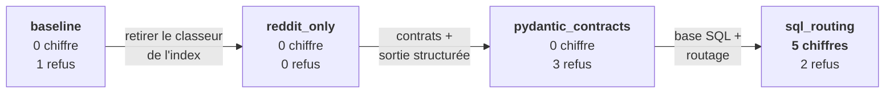

# 5. Comparatif

Quatre runs, 18 cas chacun, **aucun échec système**.

## 5.1 Les quatre métriques

| Run | `faithfulness` | `context_precision` | `context_recall` | `answer_correctness` |
|---|---|---|---|---|
| `baseline` | 0.408 | 0.165 | 0.435 | 0.196 |
| `reddit_only` | 0.231 | 0.193 | 0.352 | 0.186 |
| `pydantic_contracts` | **0.784** | 0.165 | 0.324 | 0.268 |
| `sql_routing` | 0.713 | 0.554 | 0.602 | **0.396** |

!!! danger "Deux colonnes ne se lisent pas de bout en bout"
    Sur la figure, `context_precision` et `context_recall` bondissent au quatrième run.
    **Ce n'est pas une amélioration de la recherche** : l'unité récupérée a changé entre
    le troisième et le quatrième run, et ces deux métriques ne sont donc pas comparables
    — voir [§ 6.1](analyse-critique.md). La seule métrique RAGAS comparable sur les
    quatre runs est `answer_correctness`.

## 5.2 Les contrôles sans juge

Ce sont eux qui portent les conclusions. Aucun ne dépend d'un modèle.

| | `baseline` | `reddit_only` | `pydantic_contracts` | `sql_routing` |
|---|---|---|---|---|
| **Chiffres exacts** (/8) | 0 | 0 | 0 | **5** |
| **Routage correct** (/18) | — | — | — | **15** |
| **Refus** sur questions sans réponse (/6) | 1 | 0 | **3** | 2 |
| **Citations invalides** | — | — | 0 | 0 |

## 5.3 L'évolution, lue en trois temps

**Premier temps — la source.** Retirer le classeur de l'index assainit la recherche
documentaire (`context_precision` 0.495 → 0.579 sur les questions Reddit) mais fait
chuter `faithfulness` à 0.231 : moins de sources, autant d'affirmations.

**Deuxième temps — l'encadrement.** Les contrats redressent `faithfulness` à 0.784 et
font apparaître l'abstention comme un fait mesurable : 3 refus sur 6. Les chiffres
restent à 0 sur 8 — le système a maintenant *raison* de se taire.

**Troisième temps — l'accès.** La base comble le manque : 5 chiffres sur 8, et
`answer_correctness` à 0.396. Le coût est un léger recul de `faithfulness` et d'un refus.

## 5.4 Par modalité — là où tout se joue

Les moyennes globales masquent des mouvements opposés. Le découpage par source les
révèle.

Une seule courbe décolle. Depuis le prototype livré, les questions **Excel** passent de
0.160 à **0.598** — soit **+0.438**, contre +0.141 sur les questions Reddit et **+0.023**
sur les hybrides. Le gain du projet y est concentré, et l'immobilité de la courbe
hybride dit exactement où il reste du travail.

Le creux d'Excel au second run n'est pas un accident : c'est le moment où le classeur
sort de l'index sans que rien ne l'ait encore remplacé.

Sur les questions Reddit, où le mécanisme de récupération n'a pas changé, les métriques
de contexte sont **identiques au centième** d'un run à l'autre. Tout écart global vient
donc des questions Excel — le contrôle complet est en
[§ 6.1](analyse-critique.md).

## 5.5 Écart par cas

Du prototype livré à l'état actuel, **13 cas sur 18 progressent**.

| Les quatre plus fortes hausses | Écart |
|---|---|
| C4 — total de points par équipe | **+0.805** |
| S4 — matchs joués | **+0.787** |
| C3 — meilleur 3P% au-delà de 300 tentatives | **+0.638** |
| S3 — points de Jokić | **+0.620** |

Ce sont exactement les quatre questions `excel` répondables — celles que la base a
débloquées.

| Les trois baisses notables | Écart |
|---|---|
| B6 — points en playoffs | −0.355 |
| B3 — 3P% sur les 5 derniers matchs | −0.233 |
| S5 — leadership puis points | −0.178 |

Les deux premières sont des cas **bruités** : le système répond désormais là où il se
taisait. La troisième est un cas hybride correctement routé mais qui n'a jamais appelé
l'outil SQL.

!!! note "Pourquoi le détail par cas est indispensable"
    Entre `baseline` et `reddit_only`, `answer_correctness` semble immobile
    (0.196 → 0.186). En réalité des cas bougeaient fortement en sens contraire — C6
    +0.272, B6 −0.205, S5 −0.146 — et s'annulaient. Seul le détail le montre.

## 5.6 Le détail complet

Le [notebook d'analyse](notebook.ipynb) reprend chaque run sous les mêmes angles — vue
d'ensemble, par modalité et par catégorie, détail par cas — puis les compare. Il est
**versionné avec ses sorties** : ses chiffres sont ceux des runs réels, et il se lit
sans être exécuté.
