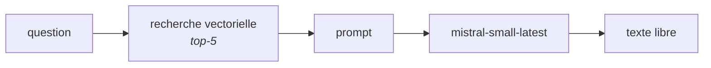
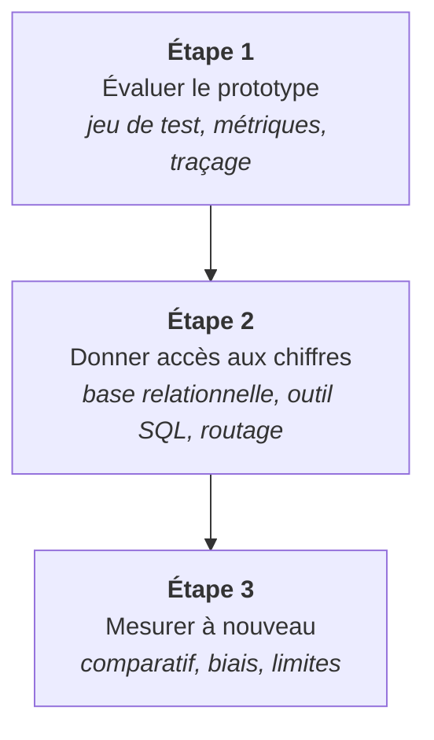

# 1. Contexte et objectifs

## Le besoin

Un club met à disposition de ses fans un assistant capable de répondre à des questions
sur la NBA, à partir de deux sources : les **discussions de supporters** et les
**statistiques officielles** de la saison régulière.

Un prototype existe. Il répond à tout, immédiatement, avec aplomb — et c'est
précisément le problème. Rien ne distingue, dans sa sortie, une réponse fondée sur les
sources d'une réponse tirée de ce que le modèle croit savoir.

La demande porte donc sur trois qualités, dans cet ordre :

| Qualité | Ce qu'elle signifie ici |
|---|---|
| **Fiabilité** | une réponse chiffrée est la bonne, et on peut le vérifier |
| **Robustesse** | une question sans réponse reçoit un refus, pas une invention |
| **Traçabilité** | on sait d'où vient chaque affirmation, après coup |

S'y ajoute une contrainte de portée : le dispositif doit être **transposable à un autre
club**. Cela écarte toute solution qui reposerait sur des correctifs écrits à la main
pour ce corpus précis.

## Le point de départ

Le prototype livré enchaîne trois étapes sans garde-fou :

Trois faiblesses structurelles en découlent, et elles se renforcent :

- **Aucune validation.** Rien ne vérifie ce qui entre dans l'index ni ce qui en sort.
  Un lot d'embeddings en échec produit des vecteurs nuls qui passent tous les contrôles
  de taille, et rendent des fragments définitivement irrécupérables.
- **Une sortie en texte libre.** Une abstention est une tournure de phrase à deviner,
  pas un champ exploitable. Impossible de compter les refus sans les lire un par un.
- **Une seule source atteignable.** Les statistiques sont dans l'index au même titre
  que le texte, donc soumises à une recherche sémantique. Or « combien de points
  Jokić a-t-il marqués ? » ressemble davantage à une phrase qui *définit* le mot
  *points* qu'à une ligne de tableau aplatie.

La troisième faiblesse est la plus coûteuse, et elle a été **mesurée avant d'être
traitée** : sur les huit questions du jeu de test appelant une valeur numérique
précise, le prototype en réussit **zéro**.

!!! warning "Un échec qui ne se voit pas"
    Le prototype ne se tait pas sur ces huit questions : il répond, avec un chiffre. Sur
    Nikola Jokić, il cite une feuille de synthèse, attribue 2 485 points à un autre
    joueur, puis admet que Jokić « n'apparaît pas dans cette feuille ». Il a lu un
    tableau *à propos* des données, jamais les données.

## La démarche

Le travail suit trois étapes, chacune close par une mesure.

**Une règle a tenu du début à la fin : une intervention, un run étiqueté.** Chaque
changement a été mesuré seul, sur le même jeu de questions, avec le même juge. C'est ce
qui permet d'écrire « les contrats font passer `faithfulness` de 0.231 à 0.784 » plutôt
que « la qualité s'est améliorée ».

Cette règle a un coût, assumé : quatre campagnes d'évaluation facturées au lieu d'une.
Elle a aussi évité une erreur d'interprétation majeure, exposée en
[analyse critique](analyse-critique.md) — un gain apparent de 0.39 sur une métrique de
récupération qui ne devait **rien** à une meilleure recherche.

## Ce qui est livré

| Livrable | Où |
|---|---|
| Le système et son installation | [README du dépôt](https://github.com/FaizaKh93/Projet10_mission) |
| La méthode d'évaluation et ses résultats | ce rapport, sections 2 à 6 |
| Le détail par cas, run par run | [notebook d'analyse](notebook.ipynb) |
| L'assistant en HTTP | [annexe API REST](annexes/api.md) |
