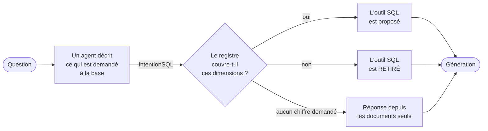

# Contexte et méthodologie

## Le diagnostic

SportSee dispose de deux sources hétérogènes : quatre fils de discussion Reddit — du
texte narratif — et un classeur Excel de statistiques NBA, 569 joueurs sur une saison,
47 colonnes.

Le prototype d'origine les traitait **de la même façon** : le classeur était converti en
texte (`df.to_string()`), découpé en fragments, et vectorisé au même titre que les PDF.

Testé sur les questions cibles de la mission, le comportement se scinde nettement :

- sur le contenu narratif, la récupération sémantique fonctionne et les réponses sont
  correctement sourcées ;
- sur les questions analytiques — *« le meilleur pourcentage à 3 points parmi ceux ayant
  tenté plus de 300 tirs »* — le modèle ne retrouve rien d'exploitable dans les fragments
  et **complète avec des chiffres qui ne proviennent pas des données de SportSee**, sans
  le signaler.

La cause n'est pas un défaut de réglage. **Une recherche par similarité sémantique ne
sait ni filtrer ni agréger.** Demander à un index vectoriel de classer 569 joueurs selon
un critère chiffré revient à lui demander une opération qu'il ne sait pas faire. Le
modèle, lui, doit produire une réponse : il la produit.

## Le principe directeur

> **Une consigne dans le prompt ne contraint rien.**

Ce n'est pas une position théorique, c'est une observation. La description de l'outil SQL
avertit explicitement le modèle :

> *Les données ne contiennent aucune granularité par match : ni date, ni adversaire, ni
> indicateur domicile/extérieur.*

Trois questions du jeu de test ont produit leur requête **malgré cet avertissement**, et
obtenu des chiffres plausibles pour une question qu'on n'avait pas posée. L'une a inventé
une partition domicile/extérieur en listant des codes d'équipes dans un `CASE WHEN` ;
une autre a rendu un total de saison régulière pour une série de playoffs.

Aucune de ces requêtes n'est invalide. **C'est précisément le danger** : le SQL réussit,
et la réponse est fluide, chiffrée, crédible.

D'où le choix méthodologique qui structure tout le reste : faire trancher le **code**
partout où c'est possible, et ne laisser au modèle que ce qu'il fait bien — comprendre
une question et rédiger.

| Décision | Qui tranche |
|---|---|
| une requête peut-elle écrire dans la base ? | l'autoriseur SQLite, sans consulter le modèle |
| une citation existe-t-elle vraiment ? | `verify_citations()`, en Python |
| quelles requêtes ont été exécutées ? | la trace d'exécution, jamais le modèle |
| la base peut-elle répondre à cette question ? | un registre de capacités, en code |

**Le modèle décrit ; le code décide.**

## Les quatre couches

Chacune a été construite puis **mesurée avant d'ajouter la suivante**. C'est ce qui permet
d'attribuer un gain à une cause, et non à l'accumulation.

### 1. Sortie structurée validée

Le prototype rendait du texte libre. La réponse devient un objet `RAGAnswer` validé par
Pydantic : une réponse, des citations, un indicateur d'abstention et sa raison.

**Ce qui est vérifié en code, pas déclaré par le modèle** : les citations référencent des
identifiants de fragments, et `verify_citations()` écarte ceux qui n'existent pas dans le
contexte réellement fourni. Un identifiant inventé est un signal d'hallucination — le
détecter en Python est déterministe, le demander au modèle ne l'est pas.

**Choix argumenté** — il n'y a volontairement **aucun champ `grounded: bool`**
auto-déclaré. Un modèle qui hallucine peut tout aussi bien affirmer que sa réponse est
fondée. La fiabilité se vérifie par les citations, pas par une auto-évaluation.

*Ce que cette couche ne règle pas* : le modèle s'abstient parfois à tort, et il ne calcule
toujours rien.

### 2. L'outil SQL

L'agent reçoit le schéma de la base et un outil qui exécute le SQL qu'il écrit. Il
travaille alors sur **l'ensemble des données**, plus sur cinq fragments.

C'est un modèle de langage qui écrit ces requêtes. La protection ne peut donc pas reposer
sur une inspection du texte produit, contournable, mais sur le moteur lui-même :

| Barrière | Mécanisme | Ce qu'elle arrête |
|---|---|---|
| Lecture seule | `file:...?mode=ro` | toute écriture, quelle que soit la requête |
| Autoriseur | `set_authorizer` | PRAGMA, ATTACH, CTE récursives, `load_extension` |
| Délai | `set_progress_handler` | produits cartésiens et requêtes sans fin |
| Limites de taille | `LIMIT` + `SQLITE_LIMIT_LENGTH` | résultats qui satureraient le prompt |

**Choix argumenté** — l'exécution ne passe pas par `QuerySQLDatabaseTool` de LangChain,
qui ouvre la base en lecture/écriture et exécute tel quel, sans autoriseur ni délai.
`SQLDatabase` n'est utilisé que pour **décrire** le schéma.

*Ce que cette couche ne règle pas* : des requêtes **valides qui répondent à une autre
question**.

### 3. Le validateur de couverture

Un premier agent décrit ce que la question demande **à la base** — granularité, période,
compétition, et trois filtres. Le **code** confronte cette description à un registre de ce
que le schéma sait exprimer, puis retire l'outil SQL si une dimension manque.

```
granularité : saison uniquement    (ni match, ni série)
période     : saison courante      (ni date précise, ni plusieurs saisons)
compétition : saison régulière     (pas de playoffs)
filtres     : ni lieu, ni adversaire, ni poste
```



*Figure 1 — Le modèle décrit, le code décide. Le losange est une règle déterministe,
testable et reproductible ; seule la première étape fait appel à un modèle.*

Retirer l'outil n'est pas une consigne : le modèle ne le voit plus dans sa liste
d'outils. Il ne peut pas passer outre.

**Choix argumenté** — chaque axe porte une valeur `autre`, jamais couverte par le
registre. Sans elle, une question sur le play-in se rabattrait sur la valeur par défaut,
qui est la seule couverte, et l'outil répondrait avec des chiffres de saison régulière.
**Ce que le vocabulaire ne sait pas exprimer doit refuser, pas se rabattre.**

*Ce que cette couche ne règle pas* : elle dépend d'une extraction faillible, réalisée par
un modèle.

### 4. Le cadrage des sources

Le prompt nomme les sources dont la réponse dispose — les fragments récupérés et les
résultats SQL — et interdit d'en sortir. La ligne annonçant la base **disparaît** quand
le validateur a retiré l'outil : promettre une source absente inviterait le modèle à
faire semblant de l'avoir consultée.

**Choix argumenté** — la formulation autorise explicitement **comparer et synthétiser**,
mais impose de *« respecter exactement le périmètre »*. Interdire toute déduction aurait
rendu insolubles quatre questions du jeu de test qui demandent une comparaison. L'erreur
réelle n'était pas la déduction, c'était l'attribution : des chiffres exacts rattachés à
un périmètre qu'ils ne couvrent pas.

## Le classeur, avant tout le reste

Deux anomalies ont été identifiées à l'exploration et **conservées plutôt que corrigées
en silence** :

- un en-tête `3PM` réinterprété par Excel comme un horaire, affiché `15:00` ;
- des pourcentages de réussite incohérents pour les joueurs à faible temps de jeu.

Les corriger sans le dire aurait masqué un problème de qualité de données appartenant à
SportSee. Elles sont documentées, et la première sert même de cas de test.

**Choix argumenté** — `matches` est modélisée mais reste **vide**. La consigne demandait de
la modéliser ; le classeur ne contient que des agrégats de saison — ni date, ni
adversaire, ni identifiant de rencontre, vérifié sur les 47 colonnes. La remplir aurait
exigé d'inventer des données.
