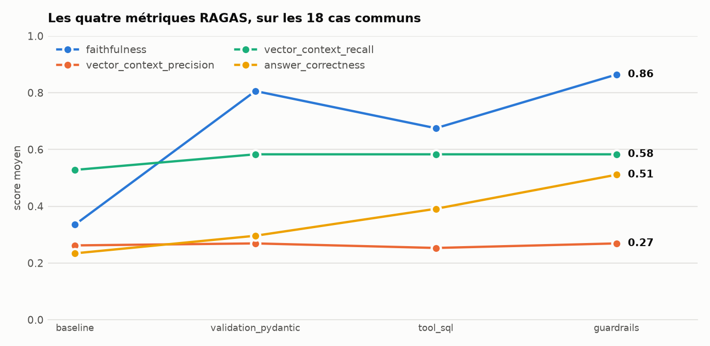
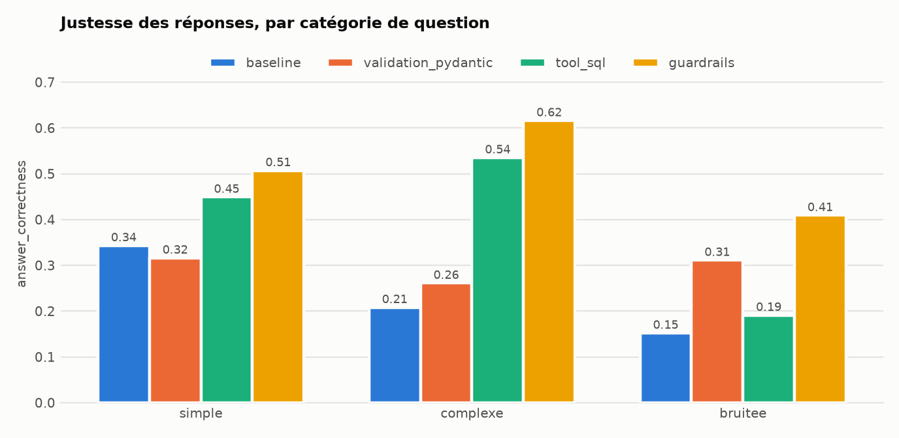

# Résultats

Tous les chiffres portent sur les **18 cas communs aux quatre runs**, sauf mention
contraire. Les six cas hybrides, ajoutés à la troisième étape, sont traités à part.

## Vue d'ensemble

*Figure 2 — produite par `eval/analyze_results.ipynb`. Deux métriques progressent, deux ne bougent pas. Les métriques de contexte
mesurent la recherche vectorielle, qui n'a jamais été modifiée.*

| Métrique | `baseline` | `validation_pydantic` | `tool_sql` | `guardrails` | écart total |
|---|---|---|---|---|---|
| `answer_correctness` | 0.234 | 0.296 | 0.391 | **0.511** | **+0.277** |
| `faithfulness` | 0.335 | 0.806 | 0.675 | **0.864** | **+0.529** |
| `vector_context_precision` | 0.262 | 0.269 | 0.253 | 0.269 | +0.007 |
| `vector_context_recall` | 0.528 | 0.583 | 0.583 | 0.583 | +0.055 |

Les deux dernières lignes ne mesurent **aucun effet du système** : la recherche
vectorielle n'a jamais été modifiée, et le contexte récupéré est identique d'un run à
l'autre. Leurs variations chiffrent la variance du juge, elles ne s'interprètent pas.

## Par catégorie de question

*Figure 3 — produite par `eval/analyze_results.ipynb`. La catégorie bruitée recule avec l'outil SQL (0.31 → 0.19) avant de dépasser
son niveau initial avec les garde-fous (0.41). C'est l'échange que décrit cette page.*

| `answer_correctness` | `baseline` | `pydantic` | `tool_sql` | `guardrails` | apport SQL | apport garde-fous |
|---|---|---|---|---|---|---|
| bruitée | 0.152 | 0.311 | 0.191 | 0.409 | **−0.120** | **+0.218** |
| complexe | 0.208 | 0.261 | 0.535 | 0.616 | **+0.274** | +0.081 |
| simple | 0.343 | 0.316 | 0.449 | 0.507 | +0.133 | +0.058 |

Cette lecture est la plus instructive du rapport, parce qu'elle montre un **échange**, pas
une amélioration linéaire.

## Ce que chaque étape a apporté

### La validation Pydantic introduit l'abstention

`faithfulness` passe de 0.335 à 0.806. Le prototype n'avait aucun moyen de dire « je ne
sais pas » : la sortie structurée lui en donne un.

Mais l'abstention sert **trois fois à tort** — le système refuse des questions qui avaient
une réponse. D'où le recul des questions simples (−0.027), seule catégorie à baisser.

### L'outil SQL apporte le calcul, et un risque nouveau

Les questions complexes gagnent **+0.274** : l'agent travaille sur 569 joueurs au lieu de
cinq fragments. Une question de classement passe de 0.133 à 0.701.

**L'échange est exactement symétrique** : deux refus injustifiés deviennent de bonnes
réponses, et deux abstentions justifiées deviennent des fabrications.

| Cas | `pydantic` | `tool_sql` | Ce qui s'est passé |
|---|---|---|---|
| B1 | 0.74 | **0.27** | *« les 5 derniers matchs »* → la saison entière, sans filtre temporel |
| B2 | 0.42 | **0.07** | une partition domicile/extérieur inventée dans un `CASE WHEN` |

La catégorie bruitée perd 0.120. **Donner au modèle une vraie source de données rend ses
réponses fausses plus crédibles, pas moins.**

### Les garde-fous corrigent précisément cela

| Cas | `tool_sql` | `guardrails` | `faithfulness` |
|---|---|---|---|
| B1 | 0.27 | **0.69** | 0.50 → **1.00** |
| B2 | 0.07 | **0.60** | 0.31 → **1.00** |
| M6 | 0.07 | **0.60** | 0.50 → **1.00** |

Les trois cas visés s'abstiennent désormais, et la catégorie bruitée regagne **+0.218** —
davantage qu'elle n'avait perdu.

Sur le jeu complet de 24 cas, l'écart entre `tool_sql` et `guardrails` vaut
**+0.182 de fidélité** et **+0.105 de justesse**.

## L'axe comportemental

Mesuré sans juge, donc sans incertitude.

| Run | `abstention_accuracy` | Refus excessifs | Questions hors périmètre non détectées |
|---|---|---|---|
| `tool_sql` | 19/24 — 79.2 % | S4 | **B1, B2, B5, M6** |
| `guardrails` | **22/24 — 91.7 %** | M2, S4 | **aucune** |

C'est le résultat le plus important du rapport, et pas seulement pour le chiffre.

**Le profil d'erreur a basculé.** Avant, le système répondait avec assurance à quatre
questions dont la réponse n'existait pas. Désormais, toutes les erreurs restantes sont des
**refus excessifs** — visibles pour l'utilisateur, qui sait qu'il n'a pas obtenu de
réponse. Une réponse fabriquée, elle, ne se signale pas.

Le coût tient en un cas : **M2**, *« ce chiffre de playoffs correspond-il à sa moyenne ? »*,
où la compétition **citée** est prise pour la compétition **demandée**, et l'outil retiré à
tort. Cette limite était connue **avant** le run — mesurée et déclarée dans la suite de
tests — et elle s'est matérialisée telle quelle.

## Le validateur, mesuré séparément

Le run `guardrails` combine deux changements. Le validateur a donc été mesuré **hors
RAGAS**, sur son propre banc :

- **22/24** sur le jeu de test
- **8/8** sur des formulations inédites, absentes du prompt comme du jeu de test

Quatre de ces huit visent des axes que l'extraction n'avait **jamais eu à produire** —
plusieurs saisons, compétition hors liste, filtre par poste, granularité inférieure au
match. Elles passent toutes : la règle généralise, elle ne rattrape pas trois cas
particuliers.

## Les cas hybrides

Six questions exigent les deux sources. Trois traversent effectivement les deux chaînes ;
les trois autres s'abstiennent — deux correctement (l'entité n'existe pas en base, le
périmètre playoffs n'est pas couvert), une à tort (M2).

Un constat qui a son importance : **emprunter les deux chaînes ne garantit pas la
justesse**. Un cas utilise bien les deux sources mais identifie les mauvaises entités, et
interroge la base sur les bons attributs des mauvais joueurs. Deux requêtes correctes, une
réponse fausse.

## Les tests de robustesse

Les huit cas bruités visent six mécanismes de défaillance distincts. Sur l'axe
comportemental : **8/8**.

Mais deux d'entre eux révèlent l'angle mort de cet axe. B3 et B6 attendent une réponse
**qui signale la limite**. L'axe ne vérifie que le fait de répondre, et les compte donc
justes — alors que leurs scores de justesse valent 0.14 et 0.03.

La lecture des réponses est plus sévère encore :

> **B3** — *« la colonne représente les minutes jouées après 15:00 de jeu […] uniquement
> pendant la période où le score est serré »* : une définition entièrement inventée pour
> une colonne corrompue par Excel.
>
> **B6** — *« les équipes les plus citées sont les Magic d'Orlando et les Rockets de
> Houston »* : un classement présenté comme exhaustif, établi sur cinq fragments d'un fil
> de quinze pages.

**C'est le mode de défaillance d'origine du prototype, intact.** Les garde-fous agissent
sur les dimensions absentes du schéma — ni sur une prémisse fausse, ni sur une limite
architecturale de la recherche.
