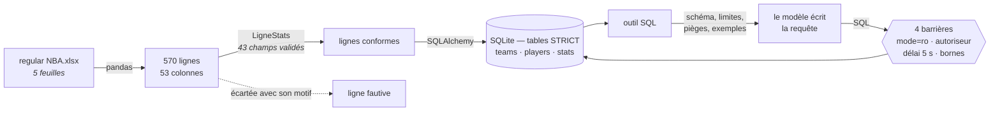
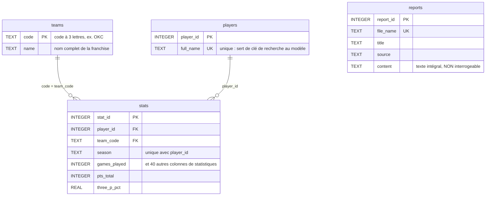

# 3.3 Le classeur de statistiques

Sur les cinq feuilles du classeur, une seule porte les données brutes : 570 lignes,
53 colonnes, un joueur par ligne. Elle est lue par pandas, **validée ligne à ligne par
Pydantic**, puis insérée par SQLAlchemy.

Une ligne fautive est **écartée avec son motif**, les autres passent : une anomalie
ponctuelle ne doit pas priver la base des 568 autres joueurs. Les tables sont déclarées
**STRICT** — SQLite refuse alors une valeur du mauvais type au lieu de la convertir en
silence.

## Le modèle de données

| Table | Contenu | Interrogeable |
|---|---|---|
| `teams` | 30 franchises | oui |
| `players` | 569 joueurs | oui |
| `stats` | 569 lignes × 47 colonnes | oui |
| `reports` | 4 fils Reddit, texte intégral | **non** |

**`UNIQUE(player_id, season)`** garantit une ligne par joueur et par saison. C'est elle
qui rend `MAX(wins_total)` interprétable comme le bilan d'une équipe, là où la somme
multiplierait par l'effectif — une saison compte 82 matchs, pas 767.

**`reports` n'a aucune relation** avec les trois autres et n'est pas offerte au modèle :
elle double l'index FAISS, et un `LIKE` n'a pas de sens sémantique. L'exclusion est
**déclarée dans le code** (`TABLES_INTERROGEABLES`), pas laissée à l'appréciation d'un
prompt.

## Pourquoi il n'y a pas de table `matches`

Le modèle relationnel demandé en prévoyait une. Le classeur n'en contient pas la
matière : ses cinq feuilles ne donnent qu'un agrégat **par joueur et par saison**,
aucune ligne par match.

!!! warning "Une table vide ment deux fois"
    Au modèle, qui croit pouvoir l'interroger. Et à qui lit le schéma, qui croit la
    donnée disponible.

Conséquences, assumées et documentées : pas de date, pas d'adversaire, **pas de
distinction domicile/extérieur**, une seule saison donc aucune comparaison.

Ces limites ne sont pas recopiées à la main. `profil_capacites()` les **dérive** de la
base par introspection : si une colonne apparaît demain, la phrase qui annonce son
absence disparaît d'elle-même. C'est ce qui rend le dispositif transposable à un autre
club sans réécriture.

## Le contrôle de l'ingestion

L'ingestion est recoupée avec une source **extérieure au code** : la feuille `Analyse`
du classeur porte ses propres totaux par équipe, calculés par quelqu'un d'autre, dans
un autre outil.

| Équipe | Feuille `Analyse` | Base construite |
|---|---|---|
| OKC | 9 880 points, 18 joueurs | 9 880, 18 |
| MIA | 9 828 points, 19 joueurs | 9 828, 19 |
| CLE | 10 180 points, 18 joueurs | 10 180, 18 |

À l'unité près. C'est la seule vérification du projet qui ne dépende ni du code écrit
ici, ni d'un modèle.

## L'outil SQL

Le modèle écrit la requête ; le code l'exécute **sans lui faire confiance**. Quatre
barrières, dont trois appliquées par SQLite lui-même plutôt que par inspection du texte
— qu'un commentaire ou une CTE contournerait.

| Barrière | Ce qu'elle empêche |
|---|---|
| connexion `mode=ro` | toute écriture, quelle que soit la requête |
| autoriseur SQLite | tout ce qui n'est pas une lecture des tables autorisées |
| gestionnaire de progression | une requête qui dépasse 5 s |
| limites de taille | un résultat ou une cellule qui ferait exploser le prompt |

La liste des tables est **blanche** : une table ajoutée demain sera refusée par défaut,
là où une liste noire l'exposerait.

**Ce que le modèle reçoit avec l'outil est dérivé de la base, jamais écrit à la main** :
le schéma réel, les limites, les pièges d'agrégation et quatre exemples de requêtes. Une
recopie manuelle finit toujours par diverger de la base — et sans le schéma réel, le
modèle devine les noms de colonnes puis épuise ses relances.

Une requête refusée n'est pas une erreur fatale : son motif est renvoyé au modèle, qui
corrige et réessaie. Mieux qu'un résultat vide, qu'il interpréterait comme « 0 ».

### Pourquoi pas la chaîne SQL clés en main de LangChain

`SQLDatabaseToolkit` et `create_sql_agent` **exécutent eux-mêmes** la requête écrite par
le modèle, donc hors des quatre barrières. Les adopter revenait à les supprimer.

LangChain sert donc ici à ce qu'il fait bien : **décrire**.
`SQLDatabase.get_table_info()` rend les `CREATE TABLE` réels et deux lignes d'exemple
par table, ce qui ancre le modèle dans les vrais noms de colonnes. L'exécution reste
dans `executer_sql()`.
