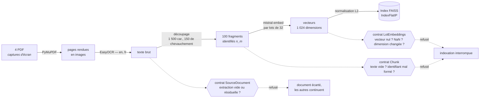

# 3.2 Les discussions Reddit

Quatre fils de discussion, fournis en PDF. Ce sont des **captures d'écran** : aucun
texte à extraire, seulement des images.

**Les trois contrats n'ont pas le même effet.** Un document illisible est **écarté** et les
trois autres continuent. Un fragment ou un lot d'embeddings non conforme **arrête
l'indexation** — parce que poursuivre produirait un index désaccordé, qui citerait le
mauvais fragment sans qu'aucune erreur ne se déclenche jamais.

## Les choix, et leurs raisons

**L'OCR plutôt qu'une extraction de texte.** PyMuPDF rend chaque page en image, EasyOCR
la lit en anglais et en français. C'est lent — une dizaine de minutes — et lancé **une
seule fois** : le chargement de la table `reports` reprend le texte déjà extrait plutôt
que de le recalculer.

**1 500 caractères, 150 de chevauchement.** Un fragment doit contenir un commentaire
entier, sinon l'argument est coupé de sa conclusion. Le chevauchement évite qu'une
phrase à cheval sur deux fragments soit perdue des deux côtés.

**`IndexFlatIP` sur des vecteurs normalisés.** Après normalisation L2, le produit
scalaire *est* la similarité cosinus — celle qui a du sens pour du texte : deux passages
proches par le sens le restent quelle que soit leur longueur.

## Le contrat le plus important du dépôt

!!! danger "Des vecteurs nuls qui passent tous les contrôles"
    Un lot d'embeddings en échec produisait des vecteurs nuls. Bonne longueur, bon
    alignement avec les fragments, tous les contrôles de taille franchis — et les
    fragments concernés devenaient **définitivement irrécupérables**, leur similarité
    valant 0 pour n'importe quelle question.

    Sans ce contrat, le défaut ne se voyait nulle part : ni à l'indexation, ni à la
    recherche, ni dans les réponses. Il se serait manifesté comme une baisse
    inexpliquée de pertinence.

`LotEmbeddings` refuse donc quatre choses : un lot plus court que ses fragments, un
vecteur de norme nulle, un `NaN`, et une dimension qui aurait changé.

## Ce qui n'est pas indexé, et pourquoi

Seuls les PDF le sont (`EXTENSIONS_INDEXEES`). Le classeur en a été retiré — et c'est
une décision **mesurée**, pas un choix a priori.

| Constat sur l'index de départ | Valeur |
|---|---|
| Part de l'index occupée par la feuille de statistiques | **47 %** (143 fragments sur 302) |
| Nombre de fois où elle est récupérée | **0 sur 90** |
| Feuille récupérée à sa place | le « Dictionnaire des données », 4 fragments, servi **25 fois** |

La cause est structurelle. Une recherche sémantique rapproche « combien de points ? »
d'une phrase qui **définit** le mot *points*, pas d'une ligne de tableau aplatie où un
nom voisine avec trente nombres sans étiquette.

Ces 143 fragments étaient donc du poids mort — et pire, ils **nuisaient** en prenant aux
fils Reddit des places dans le top-5. Les retirer a fait monter `context_precision` de
0.495 à 0.579 sur les questions Reddit ([§ 4.2](../iterations.md)).

Les chiffres viennent désormais d'ailleurs : [une base relationnelle](classeur.md).
