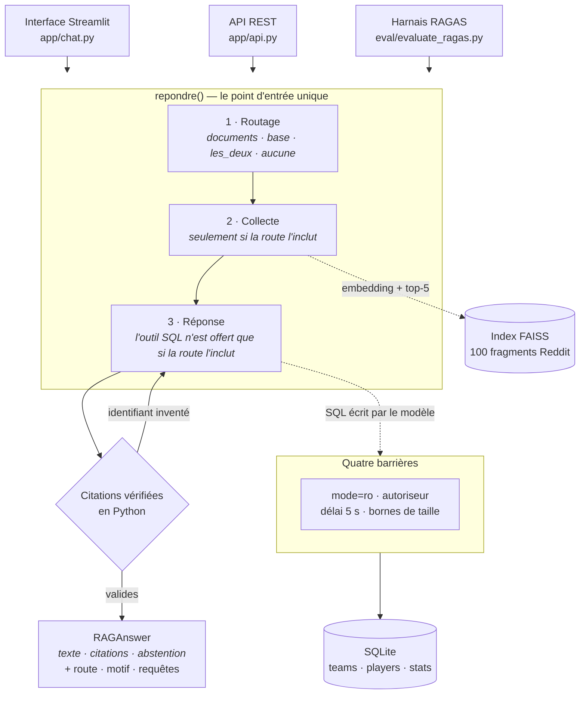
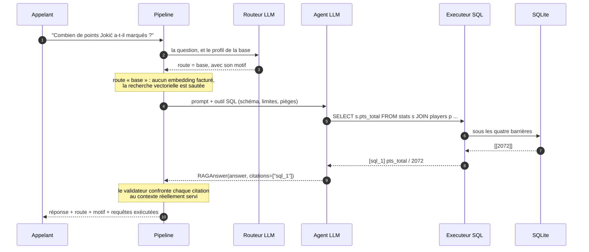

# 3.1 Vue d'ensemble

Trois interfaces, un seul chemin. L'interface web, l'API REST et le harnais
d'évaluation appellent la **même** fonction : c'est ce qui garantit qu'une réponse
mesurée est une réponse servie.

## Le principe directeur

!!! abstract "Le modèle propose, le code dispose"
    Le routeur **choisit** la source mais ne collecte pas. Le modèle **écrit** le SQL
    mais ne l'exécute pas. Il **cite** ses sources mais ses citations sont vérifiées.

Ce n'est pas une préférence de style. C'est la réponse à un constat mesuré : une
consigne dans un prompt ne contraint rien. Le même fait, écrit deux fois dans la
description d'un outil, a été ignoré par le modèle ([§ 6.3](../analyse-critique.md)).

Trois applications concrètes, toutes vérifiables dans le code :

| Ce qu'on veut empêcher | Ce qu'on ne fait pas | Ce qu'on fait |
|---|---|---|
| Interroger la base hors sujet | le déconseiller dans le prompt | **retirer l'outil** de la liste transmise au modèle |
| Écrire dans la base | interdire `INSERT` par inspection du texte | ouvrir la connexion en `mode=ro` |
| Citer un fragment inexistant | demander de citer correctement | confronter chaque citation au contexte servi, et **relancer** |

## Le parcours d'une question chiffrée

Deux détails de ce diagramme comptent plus que les autres :

- **Étape 4** — sur une route « base », aucun embedding n'est calculé. Le routage n'est
  pas qu'une orientation : c'est aussi une économie d'appels facturés.
- **Étape 12** — la réponse rendue porte la route, son motif et les requêtes exécutées.
  Sans eux, un chiffre est invérifiable ; avec eux, on rejoue la requête.

## Les contrats

Des modèles Pydantic posés à chaque frontière. Sur le chemin documentaire :

| Frontière | Ce qui est refusé |
|---|---|
| Documents chargés | extraction vide ou résiduelle, source manquante |
| Fragments découpés | texte vide, identifiant mal formé |
| **Lot d'embeddings** | lot plus court que ses fragments, **vecteur nul**, dimension changée |
| Question | question vide ou démesurée |
| Fragments récupérés | score hors de [-100, 100] |
| **Réponse** | abstention sans motif |

Le chemin chiffré a les siens, au même endroit :

| Frontière | Ce qui est refusé |
|---|---|
| **Ligne du classeur** | colonne inattendue, valeur hors bornes — et surtout une **incohérence** : plus de tirs réussis que tentés, ou victoires + défaites ≠ matchs joués |
| Franchise | code hors de 2 à 4 caractères, nom vide |
| Document chargé en base | titre, source ou contenu trop courts — insérer « Page 1 » reviendrait à enregistrer un échec d'OCR comme source |
| **Résultat de requête** | requête vide, et la troncature est **signalée** : sans ce drapeau, « les 50 premières lignes » se lirait comme « toutes » |

!!! abstract "Un contrat qui applique des règles du jeu"
    `LigneStats` ne vérifie pas que des types. Ses bornes sont **mesurées sur les 569
    lignes réelles**, et son validateur refuse une ligne incohérente — plus de tirs
    réussis que tentés, par exemple.

    Deux invariants tentants ont été écartés parce qu'ils sont **faux** sur ces
    données : `REB = OREB + DREB` échoue sur 206 lignes, et un `TS%` peut dépasser
    100 % puisque c'est une mesure pondérée, pas une proportion. Un contrat qui les
    aurait imposés aurait rejeté des lignes valides.

`SQLResult` est le seul contrat de **sortie** de ce chemin — et c'est le même objet que
l'API renvoie dans son champ `requetes`. Une définition, deux usages.

**Les citations ne sont pas prises pour argent comptant.** Un validateur confronte en
Python les identifiants cités au contexte réellement servi, et renvoie le modèle
corriger s'il en invente un. Un contrat Pydantic ne peut pas faire ce contrôle : il ne
connaît pas le contexte du run.

!!! info "La citation prouve la provenance de l'identifiant, pas celle du fait"
    Un cas du jeu de test l'a montré pendant trois runs : des chiffres fabriqués sur un
    joueur absent des données, **accompagnés de deux citations parfaitement valides**.
    Le garde-fou élimine les identifiants inventés, pas les chiffres tirés de la mémoire
    du modèle. Seul l'accès à une source structurée l'a réglé
    ([§ 7.1](../conclusion.md)).
